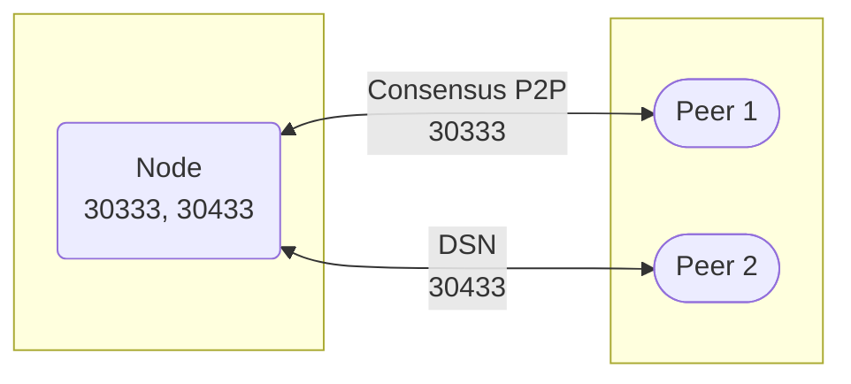
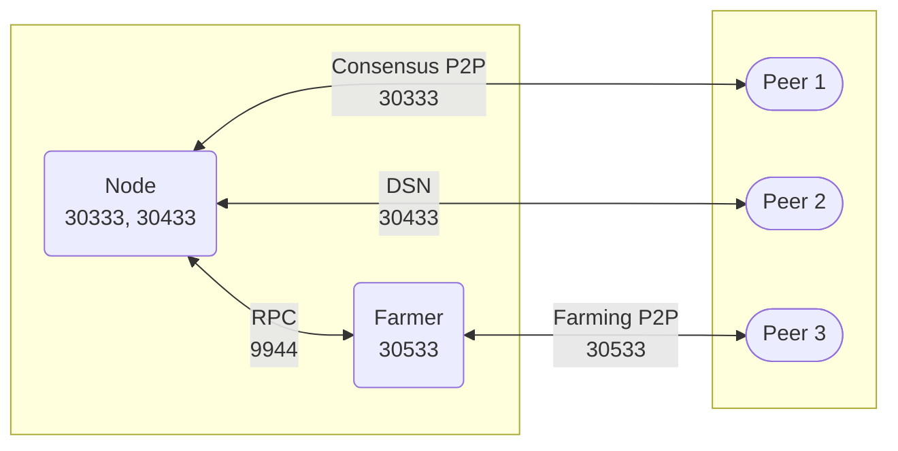
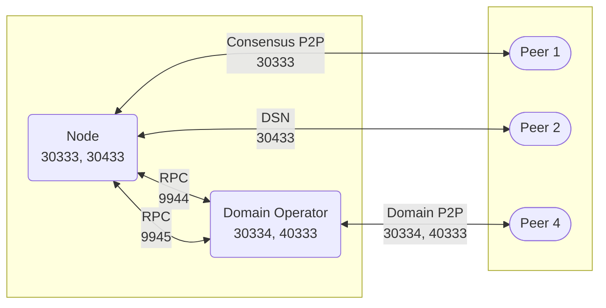
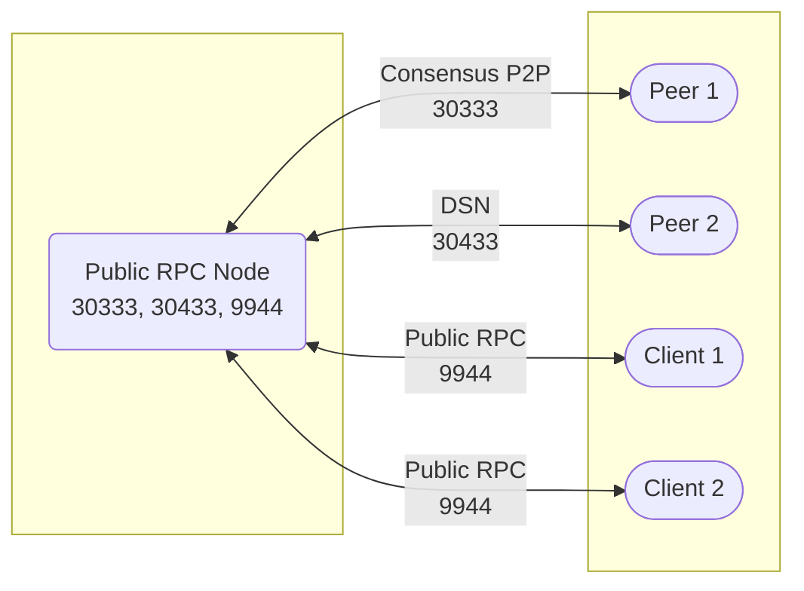
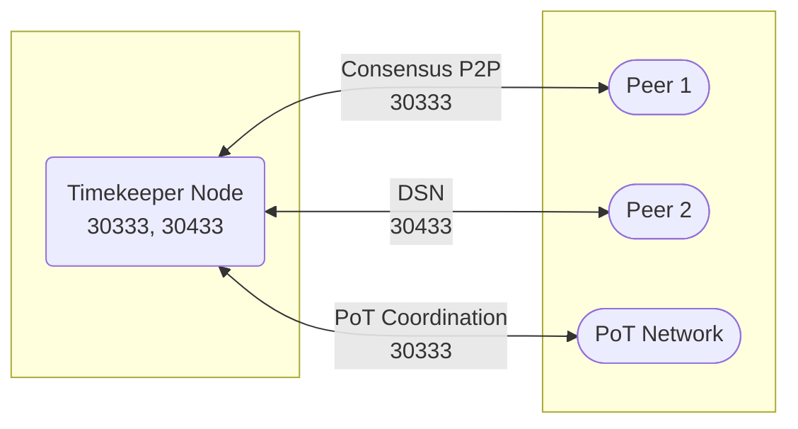

import Tabs from '@theme/Tabs';
import TabItem from '@theme/TabItem';
import Icon from '@site/src/components/Icon';
import Badge from '@site/src/components/Badge';
import { ICONS } from '@site/src/constants';
import { ContentGroup, ContentBlock, ContentText, ContentSubtitle, ContentList, ContentListItem, ContentCode, ContentFooter } from '@site/src/components/ContentBlock';

## Overview

Proper network configuration is critical for optimal Autonomys Network performance. This comprehensive guide covers everything from basic port forwarding to advanced multi-node setups and troubleshooting.

:::tip Quick Start
**New to networking?** Click on components in the [Network Architecture diagram](#network-architecture-overview) to jump to port details, then check the [Detailed Port Configuration](#detailed-port-configuration) for your setup type.

**Experienced users:** See [Advanced Scenarios](#advanced-scenarios) for farming clusters and multi-node configurations.
:::

## Why Network Configuration Matters

The Autonomys Network uses a sophisticated multi-layered architecture that requires proper port configuration for optimal performance. Understanding these requirements is crucial for successful participation.

### Network Architecture Foundation

Autonomys implements **Decoupled Execution (DecEx)**, separating consensus from computation:
- **Consensus Layer**: Farmers maintain consensus using Proof-of-Archival-Storage (PoAS) and Proof-of-Time (PoT)
- **Execution Layer**: Domain operators execute transactions and smart contracts in parallel domains
- **Storage Layer**: Three-tier Distributed Storage Network (DSN) ensures data availability

### Impact of Poor Configuration

Without proper port forwarding and firewall configuration:
- **<Icon icon={ICONS.CLOSE_CIRCLE} /> Missed Challenges**: Farmers may fail to respond to storage challenges in time, reducing rewards
- **<Icon icon={ICONS.CLOSE_CIRCLE} /> DSN Isolation**: Cannot participate effectively in the Distributed Storage Network
- **<Icon icon={ICONS.CLOSE_CIRCLE} /> Slow Block Propagation**: Delayed consensus participation affects network security
- **<Icon icon={ICONS.CLOSE_CIRCLE} /> Degraded Piece Retrieval**: Poor DSN connectivity impacts archival data availability

### Benefits of Proper Configuration

With correct configuration:
- **<Icon icon={ICONS.CHECK_CIRCLE} /> Efficient Challenge Responses**: Quick access to stored pieces for proving challenges
- **<Icon icon={ICONS.CHECK_CIRCLE} /> DSN Participation**: Full integration with the Distributed Storage Network for data retrieval and distribution
- **<Icon icon={ICONS.CHECK_CIRCLE} /> Optimal Farming Rewards**: Consistent participation in consensus and storage proving
- **<Icon icon={ICONS.CHECK_CIRCLE} /> Network Resilience**: Contribute to overall network health and decentralization

## Detailed Port Configuration

<Tabs>

<TabItem value="space-acres" label="Space Acres" default>

### Network Architecture



### Space Acres Port Requirements

| Port  | Protocol | Router Forward | Firewall Allow | Component | Purpose |
|:------|:---------|:--------------|:--------------|:----------|:--------|
| **30333** | TCP | <Icon icon={ICONS.CHECK_CIRCLE} /> Required | <Icon icon={ICONS.CHECK_CIRCLE} /> Required | Node (Consensus) | Consensus chain P2P for block propagation, transaction gossip, and Proof-of-Time coordination |
| **30433** | TCP | <Icon icon={ICONS.CHECK_CIRCLE} /> Required | <Icon icon={ICONS.CHECK_CIRCLE} /> Required | Node (DSN) | DSN layer communication for archival data retrieval, piece distribution, and farmer coordination |

**Configuration Example:**

<Tabs>
<TabItem value="router" label="Router Setup">

```bash
# Port Forwarding Rules (adjust IP to your machine)
External Port: 30333 to Internal IP: 192.168.1.100, Port: 30333
External Port: 30433 to Internal IP: 192.168.1.100, Port: 30433
```

</TabItem>
<TabItem value="linux-fw" label="Linux Firewall">

```bash
# UFW (Ubuntu/Debian)
sudo ufw allow 30333/tcp comment 'Autonomys Consensus'
sudo ufw allow 30433/tcp comment 'Autonomys DSN'

# Check status
sudo ufw status verbose
```

</TabItem>
<TabItem value="windows-fw" label="Windows Firewall">

```powershell
# PowerShell (Run as Administrator)
New-NetFirewallRule -DisplayName "Autonomys Consensus" -Direction Inbound -Protocol TCP -LocalPort 30333 -Action Allow
New-NetFirewallRule -DisplayName "Autonomys DSN" -Direction Inbound -Protocol TCP -LocalPort 30433 -Action Allow

# Verify rules
Get-NetFirewallRule -DisplayName "Autonomys*"
```

</TabItem>
</Tabs>

</TabItem>

<TabItem value="cli-farmer" label="CLI Farming">

### Network Architecture



:::caution Security Warning
**RPC port 9944 should NEVER be exposed to the internet** unless running a public RPC server. This port is for local network communication only.
:::

### CLI Farming Port Requirements

| Port  | Protocol | Router Forward | Firewall Allow | Component | Purpose |
|:------|:---------|:--------------|:--------------|:----------|:--------|
| **30333** | TCP | <Icon icon={ICONS.CHECK_CIRCLE} /> Required | <Icon icon={ICONS.CHECK_CIRCLE} /> Required | Node (Consensus) | Consensus chain P2P for block propagation, transaction gossip, and Proof-of-Time coordination |
| **30433** | TCP | <Icon icon={ICONS.CHECK_CIRCLE} /> Required | <Icon icon={ICONS.CHECK_CIRCLE} /> Required | Node (DSN) | DSN layer communication for archival data retrieval, piece distribution, and farmer coordination |
| **30533** | TCP | <Icon icon={ICONS.CHECK_CIRCLE} /> Required | <Icon icon={ICONS.CHECK_CIRCLE} /> Required | Farmer | Farmer P2P network for piece storage announcements, challenge responses, and DSN participation |
| **9944** | TCP | <Icon icon={ICONS.CLOSE_CIRCLE} /> Never | <Icon icon={ICONS.CHECK_CIRCLE} /> Local only | Node RPC | Consensus chain RPC for farmer-node coordination, transaction submission, and blockchain state queries |

**Complete Network Setup:**

<Tabs>
<TabItem value="windows" label="Windows Setup">

### Step 1: Router Port Forwarding

```bash
# Port Forwarding Rules (adjust IP to your machine)
External Port: 30333 → Internal IP: 192.168.1.100, Port: 30333
External Port: 30433 → Internal IP: 192.168.1.100, Port: 30433
External Port: 30533 → Internal IP: 192.168.1.100, Port: 30533
```

### Step 2: Windows Firewall Configuration

```powershell
# Run PowerShell as Administrator

# Create Inbound Rules for CLI Farming
New-NetFirewallRule -DisplayName "Autonomys Consensus" -Direction Inbound -Protocol TCP -LocalPort 30333 -Action Allow
New-NetFirewallRule -DisplayName "Autonomys DSN" -Direction Inbound -Protocol TCP -LocalPort 30433 -Action Allow
New-NetFirewallRule -DisplayName "Autonomys Farmer" -Direction Inbound -Protocol TCP -LocalPort 30533 -Action Allow

# RPC for Local Network Only
New-NetFirewallRule -DisplayName "Autonomys RPC Local" -Direction Inbound -Protocol TCP -LocalPort 9944 -RemoteAddress LocalSubnet -Action Allow

# Check configured rules
Get-NetFirewallRule -DisplayName "Autonomys*" | Format-Table -Property DisplayName, Enabled, Direction, Action
```

**Alternative GUI Method:**
1. Open Windows Defender Firewall with Advanced Security
2. Click "Inbound Rules" > "New Rule"
3. Select "Port" > TCP > Specific local ports: 30333, 30433, 30533
4. Allow the connection
5. Apply to all profiles
6. Name: "Autonomys Network Ports"

</TabItem>
<TabItem value="linux" label="Linux Setup">

### Step 1: Router Port Forwarding

```bash
# Port Forwarding Rules (adjust IP to your machine)
External Port: 30333 → Internal IP: 192.168.1.100, Port: 30333
External Port: 30433 → Internal IP: 192.168.1.100, Port: 30433
External Port: 30533 → Internal IP: 192.168.1.100, Port: 30533
```

### Step 2: Linux Firewall Configuration

#### UFW (Uncomplicated Firewall)

```bash
# Enable UFW if not already active
sudo ufw enable

# CLI Farming Ports
sudo ufw allow 30333/tcp comment 'Autonomys Consensus'
sudo ufw allow 30433/tcp comment 'Autonomys DSN'
sudo ufw allow 30533/tcp comment 'Autonomys Farmer'

# RPC for Local Network Only (adjust subnet as needed)
sudo ufw allow from 192.168.1.0/24 to any port 9944 proto tcp comment 'Node RPC Local'

# Check status
sudo ufw status verbose
```

#### iptables (Advanced Users)

```bash
# Allow Autonomys P2P Ports
sudo iptables -A INPUT -p tcp --dport 30333 -j ACCEPT
sudo iptables -A INPUT -p tcp --dport 30433 -j ACCEPT
sudo iptables -A INPUT -p tcp --dport 30533 -j ACCEPT

# Save rules (varies by distribution)
sudo iptables-save > /etc/iptables/rules.v4  # Debian/Ubuntu
sudo service iptables save                    # RHEL/CentOS
```

</TabItem>
<TabItem value="macos" label="macOS Setup">

### Step 1: Router Port Forwarding

```bash
# Port Forwarding Rules (adjust IP to your machine)
External Port: 30333 → Internal IP: 192.168.1.100, Port: 30333
External Port: 30433 → Internal IP: 192.168.1.100, Port: 30433
External Port: 30533 → Internal IP: 192.168.1.100, Port: 30533
```

### Step 2: macOS Firewall Configuration

macOS typically allows outgoing connections by default. For incoming:

```bash
# Using pfctl (requires sudo)
echo "pass in proto tcp from any to any port 30333" | sudo tee -a /etc/pf.conf
echo "pass in proto tcp from any to any port 30433" | sudo tee -a /etc/pf.conf
echo "pass in proto tcp from any to any port 30533" | sudo tee -a /etc/pf.conf

# Reload firewall rules
sudo pfctl -f /etc/pf.conf
sudo pfctl -e
```

**Alternative GUI Method:**
1. System Preferences > Security & Privacy > Firewall
2. Click "Firewall Options"
3. Add Space Acres or subspace-node to allowed applications

</TabItem>
</Tabs>

</TabItem>

<TabItem value="cli-domain" label="Domain Operator" >

### Network Architecture



:::caution Security Warning
**RPC ports (9944, 9945) should NEVER be exposed to the internet** unless running a public RPC server. These ports are for local network communication only.
:::

### Domain Operator Port Requirements <Badge variant="testnet" text="Testnet" />

| Port  | Protocol | Router Forward | Firewall Allow | Component | Purpose |
|:------|:---------|:--------------|:--------------|:----------|:--------|
| **30333** | TCP | <Icon icon={ICONS.CHECK_CIRCLE} /> Required | <Icon icon={ICONS.CHECK_CIRCLE} /> Required | Node (Consensus) | Consensus chain P2P for block propagation, transaction gossip, and Proof-of-Time coordination |
| **30334** | TCP | <Icon icon={ICONS.CHECK_CIRCLE} /> Required | <Icon icon={ICONS.CHECK_CIRCLE} /> Required | Domain Node | Domain execution layer P2P for transaction bundling, execution receipts, and fraud proof coordination |
| **30433** | TCP | <Icon icon={ICONS.CHECK_CIRCLE} /> Required | <Icon icon={ICONS.CHECK_CIRCLE} /> Required | Node (DSN) | DSN layer communication for archival data retrieval, piece distribution, and farmer coordination |
| **40333** | TCP | <Icon icon={ICONS.CHECK_CIRCLE} /> Required | <Icon icon={ICONS.CHECK_CIRCLE} /> Required | Domain Operator | Domain operator coordination for bundle production, election participation, and cross-domain messaging |
| **9944** | TCP | <Icon icon={ICONS.CLOSE_CIRCLE} /> Never | <Icon icon={ICONS.CHECK_CIRCLE} /> Local only | Consensus RPC | Consensus chain RPC for farmer-node coordination, transaction submission, and blockchain state queries |
| **9945** | TCP | <Icon icon={ICONS.CLOSE_CIRCLE} /> Never | <Icon icon={ICONS.CHECK_CIRCLE} /> Local only | Domain RPC | Domain execution RPC for smart contract deployment, transaction execution, and domain state management |

</TabItem>

<TabItem value="farming-cluster" label="Farming Cluster">

### Network Architecture


:::caution Security Warning
**RPC port 9944 should NEVER be exposed to the internet** unless running a public RPC server. This port is for local network communication only.
:::

### Farming Cluster Port Requirements

Farming clusters require careful port planning across multiple components:

| Port | Protocol | Router Forward | Firewall Allow | Component | Purpose |
|:-----|:---------|:--------------|:--------------|:----------|:--------|
| **30333** | TCP | <Icon icon={ICONS.CHECK_CIRCLE} /> Required | <Icon icon={ICONS.CHECK_CIRCLE} /> Required | Node | Consensus chain P2P for block propagation and PoT coordination |
| **30433** | TCP | <Icon icon={ICONS.CHECK_CIRCLE} /> Required | <Icon icon={ICONS.CHECK_CIRCLE} /> Required | Node | DSN layer communication for archival data retrieval |
| **30533** | TCP | <Icon icon={ICONS.CHECK_CIRCLE} /> Required | <Icon icon={ICONS.CHECK_CIRCLE} /> Required | Controller | Controller P2P network for piece storage and challenge responses |
| **9944** | TCP | <Icon icon={ICONS.CLOSE_CIRCLE} /> Never | <Icon icon={ICONS.CHECK_CIRCLE} /> Local only | Node RPC | Consensus chain RPC for controller-node coordination and cluster management |
| **4222** | TCP | <Icon icon={ICONS.CLOSE_CIRCLE} /> Never | <Icon icon={ICONS.CHECK_CIRCLE} /> Local only | NATS | Message broker for cluster coordination |

**Multi-Farmer Example:**
```bash
# Farmer 1: --listen-on /ip4/0.0.0.0/tcp/30533
# Farmer 2: --listen-on /ip4/0.0.0.0/tcp/30534
# Farmer 3: --listen-on /ip4/0.0.0.0/tcp/30535
```

</TabItem>

<TabItem value="public-rpc" label="Public RPC Server">

:::info Advanced Infrastructure Setup
This setup is for organizations running public blockchain infrastructure services. **Most users should never set this up** - regular farmers should never expose RPC ports. This tab exists to show the contrast with secure farming setups.
:::

### Network Architecture



:::caution Security Warning
**Running a public RPC server requires significant security expertise, infrastructure, and ongoing maintenance.** This is not recommended for individual farmers.
:::

### Public RPC Server Port Requirements

Public RPC servers must expose additional ports to provide blockchain data access to the public:

| Port | Protocol | Router Forward | Firewall Allow | Component | Purpose |
|:-----|:---------|:--------------|:--------------|:----------|:--------|
| **30333** | TCP | <Icon icon={ICONS.CHECK_CIRCLE} /> Required | <Icon icon={ICONS.CHECK_CIRCLE} /> Required | Node (Consensus) | Consensus chain P2P for block propagation, transaction gossip, and Proof-of-Time coordination |
| **30433** | TCP | <Icon icon={ICONS.CHECK_CIRCLE} /> Required | <Icon icon={ICONS.CHECK_CIRCLE} /> Required | Node (DSN) | DSN layer communication for archival data retrieval, piece distribution, and network coordination |
| **9944** | TCP | <Icon icon={ICONS.CHECK_CIRCLE} /> **Required** | <Icon icon={ICONS.CHECK_CIRCLE} /> **Required** | Consensus RPC | **Public consensus chain RPC endpoint for external applications** |
| **9945** | TCP | <Icon icon={ICONS.QUESTION_CIRCLE} /> Optional | <Icon icon={ICONS.QUESTION_CIRCLE} /> Optional | Domain RPC | Public domain execution RPC (only if running a domain operator) |

**Configuration Example:**

```bash
# Public RPC Server Configuration (Archive Node)
./subspace-node run \
--chain mainnet \
--base-path "/var/lib/subspace" \
--name "Public-RPC-Server" \
--blocks-pruning archive \
--state-pruning archive \
--sync full \
--rpc-methods unsafe \
--rpc-cors all \
--rpc-listen-on 0.0.0.0:9944 \
--listen-on /ip4/0.0.0.0/tcp/30333 \
--dsn-listen-on /ip4/0.0.0.0/tcp/30433
```

**Security Requirements:**
- **DDoS protection and rate limiting** (essential)
- **Load balancing and monitoring** infrastructure
- **Regular security updates** and patch management
- **Professional firewall** configuration beyond basic port forwarding
- **Dedicated infrastructure** with high bandwidth and uptime requirements

**Official Public RPC Endpoints (for reference):**
- Mainnet: `wss://rpc-0.mainnet.autonomys.xyz/ws`
- Testnet: `wss://rpc.taurus.autonomys.xyz/ws`

</TabItem>

<TabItem value="timekeeper" label="Timekeeper">

### Network Architecture



### Timekeeper Port Requirements

Timekeepers run the Proof-of-Time chain and maintain the randomness beacon that secures the consensus chain. They use the same networking infrastructure as regular nodes but require high-performance hardware and low-latency connections.

| Port | Protocol | Router Forward | Firewall Allow | Component | Purpose |
|:-----|:---------|:--------------|:--------------|:----------|:--------|
| **30333** | TCP | <Icon icon={ICONS.CHECK_CIRCLE} /> Required | <Icon icon={ICONS.CHECK_CIRCLE} /> Required | Node (Consensus + PoT) | Consensus chain P2P for block propagation **and Proof-of-Time coordination** |
| **30433** | TCP | <Icon icon={ICONS.CHECK_CIRCLE} /> Required | <Icon icon={ICONS.CHECK_CIRCLE} /> Required | Node (DSN) | DSN layer communication for archival data retrieval and network participation |
| **9944** | TCP | <Icon icon={ICONS.CLOSE_CIRCLE} /> Never | <Icon icon={ICONS.CHECK_CIRCLE} /> Local only | Node RPC | Consensus chain RPC for monitoring and local management |

**Configuration Example:**

```bash
# Timekeeper Node Configuration
./subspace-node run \
--chain mainnet \
--timekeeper \
--timekeeper-cpu-cores 4 \
--base-path "<BASE_PATH>" \
--name "Timekeeper-Node"
```

**Key Differences from Regular Farming:**
- **No farmer port (30533)** - timekeepers don't participate in storage farming
- **Higher performance requirements** - need powerful CPUs for 1-second PoT evaluation
- **Lower latency critical** - network timing affects PoT chain performance
- **Same port forwarding** - uses standard consensus node ports

**Performance Requirements:**
- **Low-latency internet connection** (critical for 1-second time slots)
- **High-performance CPU** (dedicated cores recommended)
- **Stable connectivity** (intermittent connections disrupt PoT chain)
- **Geographic distribution** encouraged for network decentralization

</TabItem>

</Tabs>

---

## Advanced Scenarios

<Tabs>
<TabItem value="dual-network" label="Mainnet + Testnet" default>

### Running Mainnet and Testnet Simultaneously

Running both networks on the same machine requires port separation:

```bash
# Mainnet Configuration
./subspace-node --chain mainnet \
                --listen-on /ip4/0.0.0.0/tcp/30333 \
                --dsn-listen-on /ip4/0.0.0.0/tcp/30433

# Testnet Configuration
./subspace-node --chain chronos \
                --listen-on /ip4/0.0.0.0/tcp/31333 \
                --dsn-listen-on /ip4/0.0.0.0/tcp/31433
```

**Port Assignments:**
- **Mainnet**: 30333 (consensus), 30433 (DSN), 30533 (farmer)
- **Testnet**: 31333 (consensus), 31433 (DSN), 31533 (farmer)

### Shared Node, Multiple Farmers

For resource efficiency, you can share a single node across multiple farmers:

```bash
# Single Node (Machine 1)
./subspace-node --listen-on /ip4/0.0.0.0/tcp/30333 \
                --dsn-listen-on /ip4/0.0.0.0/tcp/30433 \
                --rpc-listen-on 0.0.0.0:9944

# Farmer 1 (Machine 2)
./subspace-farmer --node-rpc-url ws://machine1:9944 \
                  --listen-on /ip4/0.0.0.0/tcp/30533

# Farmer 2 (Machine 3)
./subspace-farmer --node-rpc-url ws://machine1:9944 \
                  --listen-on /ip4/0.0.0.0/tcp/30534
```

**Router Configuration:**
- Forward 30333, 30433 to Machine 1 (node)
- Forward 30533, 30534 to Machine 2, 3 (farmers)

:::tip Resource Efficiency
This setup reduces resource usage by sharing a single node across multiple farmers.
:::

</TabItem>

<TabItem value="farming-clusters" label="Farming Clusters">

### Large-Scale Farming Cluster Setup

Farming clusters distribute components across multiple machines for maximum efficiency:

```bash
# Controller Node (Machine 1)
./subspace-node --listen-on /ip4/0.0.0.0/tcp/30333 \
                --dsn-listen-on /ip4/0.0.0.0/tcp/30433

# NATS Server (Machine 1 or dedicated)
nats-server --port 4222

# Cache Server (Machine 2)
./subspace-farmer cache --nats-server nats://machine1:4222

# Plotter (Machine 3)
./subspace-farmer cluster --nats-server nats://machine1:4222 \
                          plotter --node-rpc-url ws://machine1:9944

# Farmer (Machine 4)
./subspace-farmer cluster --nats-server nats://machine1:4222 \
                          farmer --node-rpc-url ws://machine1:9944 \
                          --listen-on /ip4/0.0.0.0/tcp/30533
```

</TabItem>
</Tabs>

---

## Port Forwarding Setup

### Step-by-Step Guide

<ContentGroup title="Universal Port Forwarding Steps" icon={<Icon icon={ICONS.ROUTER} />}>
  <ContentBlock title="Step 1: Find Your Network Information" showShare={false}>
    <ContentSubtitle>Locate Required IP Addresses:</ContentSubtitle>
    <Tabs>
      <TabItem value="windows" label="Windows">
        <ContentCode language="powershell">
{`# Find Router IP (Default Gateway)
ipconfig | findstr "Default Gateway"

# Find Your Computer's IP
ipconfig | findstr "IPv4 Address"`}
        </ContentCode>
      </TabItem>
      <TabItem value="linux" label="Linux/macOS">
        <ContentCode language="bash">
{`# Find Router IP (Default Gateway)
ip route | grep default
# or
netstat -rn | grep default

# Find Your Computer's IP
hostname -I | awk '{print $1}'`}
        </ContentCode>
      </TabItem>
    </Tabs>
  </ContentBlock>

  <ContentBlock title="Step 2: Access Router Admin Panel" showShare={false}>
    <ContentList>
      <ContentListItem>Open web browser and enter router IP (typically 192.168.1.1 or 192.168.0.1)</ContentListItem>
      <ContentListItem>Login with admin credentials (check router label or manual)</ContentListItem>
      <ContentListItem>Navigate to "Port Forwarding", "Virtual Servers", or "NAT" section</ContentListItem>
    </ContentList>
  </ContentBlock>

  <ContentBlock title="Step 3: Create Port Forwarding Rules" showShare={false}>
    <ContentSubtitle>For Each Required Port:</ContentSubtitle>
    <ContentList>
      <ContentListItem><strong>Service Name:</strong> Autonomys-Consensus (or similar)</ContentListItem>
      <ContentListItem><strong>Protocol:</strong> TCP</ContentListItem>
      <ContentListItem><strong>External Port:</strong> 30333</ContentListItem>
      <ContentListItem><strong>Internal Port:</strong> 30333</ContentListItem>
      <ContentListItem><strong>Internal IP:</strong> Your computer's IP address</ContentListItem>
      <ContentListItem><strong>Enabled:</strong> Yes/Checked</ContentListItem>
    </ContentList>
    <ContentFooter>
      Repeat for each required port (30333, 30433, 30533 as needed)
    </ContentFooter>
  </ContentBlock>
</ContentGroup>

### Router-Specific Guides

| Router Brand | Navigation Path | Documentation |
|:-------------|:----------------|:--------------|
| **TP-Link** | Forwarding → Virtual Servers | [Setup Guide](https://www.tp-link.com/us/support/faq/1379/) |
| **Netgear** | Advanced Setup → Port Forwarding/Port Triggering | [Setup Guide](https://kb.netgear.com/24290/How-do-I-add-a-custom-port-forwarding-service-on-my-NETGEAR-router) |
| **Linksys** | Security → Apps and Gaming | [Setup Guide](https://support.linksys.com/kb/article/318-en/) |
| **ASUS** | WAN → Virtual Server/Port Forwarding | [Setup Guide](https://www.asus.com/support/faq/1037906/) |
| **D-Link** | Advanced → Port Forwarding | [Setup Guide](https://www.dlink.com/uk/en/support/faq/routers/mydlink-routers/dir-810l/how-do-i-configure-port-forwarding-on-my-router) |


---

## Troubleshooting Network Issues

### Common Problems and Solutions

<ContentGroup title="Network Troubleshooting Guide" icon={<Icon icon={ICONS.LIMITED} />}>

  <ContentBlock title="Problem: Node shows few or no peers" severity="high" showShare={false}>
    <ContentSubtitle>Symptoms:</ContentSubtitle>
    <ContentList>
      <ContentListItem>Peer count stays at 0 or very low (under 5)</ContentListItem>
      <ContentListItem>Slow or stuck synchronization</ContentListItem>
      <ContentListItem>Logs show "No peers available" messages</ContentListItem>
    </ContentList>

    <ContentSubtitle>Solutions:</ContentSubtitle>
    <ContentList>
      <ContentListItem><strong>Verify port forwarding:</strong> Use online port checker (see below)</ContentListItem>
      <ContentListItem><strong>Check firewall:</strong> Temporarily disable to test, then re-enable with proper rules</ContentListItem>
      <ContentListItem><strong>Restart node:</strong> Sometimes helps establish new connections</ContentListItem>
      <ContentListItem><strong>Check ISP restrictions:</strong> Some ISPs block P2P traffic</ContentListItem>
    </ContentList>
  </ContentBlock>

  <ContentBlock title="Problem: Farmer not earning rewards" severity="medium" showShare={false}>
    <ContentSubtitle>Possible Network Causes:</ContentSubtitle>
    <ContentList>
      <ContentListItem>Port 30533 not forwarded (CLI farming)</ContentListItem>
      <ContentListItem>High network latency causing missed challenges</ContentListItem>
      <ContentListItem>Intermittent connectivity issues</ContentListItem>
    </ContentList>

    <ContentSubtitle>Diagnostics:</ContentSubtitle>
    <ContentCode language="bash">
{`# Check farmer connectivity
grep "peers" farmer.log | tail -20

# Monitor network latency
ping -c 100 8.8.8.8 | grep "avg"`}
    </ContentCode>
  </ContentBlock>

  <ContentBlock title="Problem: Double NAT / CGNAT Issues" severity="high" showShare={false}>
    <ContentSubtitle>Identification:</ContentSubtitle>
    <ContentText>
      Your ISP may use Carrier-Grade NAT (CGNAT), preventing port forwarding. Check if your WAN IP starts with:
    </ContentText>
    <ContentList>
      <ContentListItem>10.x.x.x</ContentListItem>
      <ContentListItem>100.64.x.x to 100.127.x.x</ContentListItem>
      <ContentListItem>172.16.x.x to 172.31.x.x</ContentListItem>
    </ContentList>

    <ContentSubtitle>Solutions:</ContentSubtitle>
    <ContentList>
      <ContentListItem><strong>Contact ISP:</strong> Request a public IP address</ContentListItem>
      <ContentListItem><strong>VPN with port forwarding:</strong> Use services that support it</ContentListItem>
      <ContentListItem><strong>IPv6:</strong> If available, may bypass CGNAT issues</ContentListItem>
    </ContentList>
  </ContentBlock>

  <ContentBlock title="Port Conflict Errors" severity="medium" showShare={false}>
    <ContentSubtitle>Error Messages:</ContentSubtitle>
    <ContentCode language="text">
{`"Address already in use"
"Failed to bind to port 30333"`}
    </ContentCode>

    <ContentSubtitle>Resolution:</ContentSubtitle>
    <ContentCode language="bash">
{`# Find process using port (Linux/macOS)
sudo lsof -i :30333

# Find process using port (Windows)
netstat -ano | findstr :30333

# Kill conflicting process or use different port
--listen-on /ip4/0.0.0.0/tcp/31333`}
    </ContentCode>
  </ContentBlock>
</ContentGroup>

### Performance Requirements

Understanding bandwidth and latency requirements helps optimize your farming setup:

<ContentGroup title="Network Performance Guidelines" icon={<Icon icon={ICONS.PERFORMANCE} />}>
  <ContentBlock title="Bandwidth Requirements" showShare={false}>
    <ContentSubtitle>Minimum Requirements by Role:</ContentSubtitle>
    <ContentList>
      <ContentListItem><strong>Space Acres/Basic Farming:</strong> 10 Mbps upload, 25 Mbps download</ContentListItem>
      <ContentListItem><strong>CLI Farming (Multiple farms):</strong> 20+ Mbps upload, 50+ Mbps download</ContentListItem>
      <ContentListItem><strong>Domain Operators:</strong> 50+ Mbps upload, 100+ Mbps download</ContentListItem>
      <ContentListItem><strong>Farming Clusters:</strong> 100+ Mbps upload, 200+ Mbps download</ContentListItem>
    </ContentList>
  </ContentBlock>

  <ContentBlock title="Latency Considerations" showShare={false}>
    <ContentSubtitle>Critical Timing Requirements:</ContentSubtitle>
    <ContentList>
      <ContentListItem><strong>Challenge Response Time:</strong> Farmers must respond to storage challenges within the challenge window</ContentListItem>
      <ContentListItem><strong>Block Propagation:</strong> Low latency (< 100ms) improves consensus participation</ContentListItem>
      <ContentListItem><strong>Piece Retrieval:</strong> DSN cache misses require quick L1 archival access</ContentListItem>
      <ContentListItem><strong>Domain Bundles:</strong> Operators need fast execution receipt submission</ContentListItem>
    </ContentList>
  </ContentBlock>

  <ContentBlock title="Connection Stability" showShare={false}>
    <ContentSubtitle>Network Reliability Impact:</ContentSubtitle>
    <ContentList>
      <ContentListItem><strong>Intermittent Connectivity:</strong> Can cause missed challenges and reduced farming rewards</ContentListItem>
      <ContentListItem><strong>High Jitter:</strong> Affects DSN piece retrieval and cache efficiency</ContentListItem>
      <ContentListItem><strong>Packet Loss:</strong> Impacts P2P gossip protocols and consensus participation</ContentListItem>
    </ContentList>
  </ContentBlock>
</ContentGroup>

### Network Verification Tools

#### Port Forwarding Verification

```bash
# Check if your ports are accessible from internet
curl -s https://api.ipify.org  # Get your public IP first

# Then test ports using online tools or:
nc -zv YOUR_PUBLIC_IP 30333    # Linux/macOS
Test-NetConnection -ComputerName YOUR_PUBLIC_IP -Port 30333  # Windows PowerShell
```

**Online Port Checkers:**
- [YouGetSignal Port Checker](https://www.yougetsignal.com/tools/open-ports/)
- [CanYouSeeMe.org](https://canyouseeme.org/)
- [Port Checker by What Is My IP](https://www.whatismyip.com/port-scanner/)

:::warning Port Checker Limitations
Online port checkers may show ports as "closed" if no service is actively listening. Ensure your node/farmer is running when testing.
:::

#### Network Diagnostics Commands

<Tabs>
<TabItem value="basic" label="Basic Checks">

```bash
# Check local listening ports
netstat -tuln | grep 30           # Linux
netstat -an | findstr :30          # Windows
lsof -i :30333                     # macOS

# Test connectivity to peers
ping telemetry.subspace.foundation
nslookup subspace.network

# Check routing table
route -n                           # Linux/macOS
route print                        # Windows
```

</TabItem>

<TabItem value="advanced" label="Advanced Diagnostics">

```bash
# Trace network path
traceroute telemetry.subspace.foundation    # Linux/macOS
tracert telemetry.subspace.foundation       # Windows

# Monitor active connections
watch 'netstat -tn | grep -E "30333|30433|30533"'  # Linux
while (1) { netstat -an | findstr "30333"; Start-Sleep 2 }  # Windows PowerShell

# Check MTU issues
ping -f -l 1472 8.8.8.8            # Windows
ping -M do -s 1472 8.8.8.8         # Linux

# Bandwidth test
iperf3 -c iperf.he.net -p 5201    # Requires iperf3 installation
```

</TabItem>
</Tabs>

---

## Best Practices & Security

<ContentGroup title="Network Security Best Practices" icon={<Icon icon={ICONS.FIREWALL} />}>
  <ContentBlock title="Essential Security Guidelines" showShare={false}>
    <ContentList>
      <ContentListItem><strong>Never expose RPC ports (9944, 9945) to the internet</strong> - These should only be accessible locally</ContentListItem>
      <ContentListItem><strong>Use firewall rules</strong> - Don't rely solely on router port forwarding</ContentListItem>
      <ContentListItem><strong>Regular updates</strong> - Keep node and farmer software up to date</ContentListItem>
      <ContentListItem><strong>Monitor connections</strong> - Regularly check active connections and peer counts</ContentListItem>
      <ContentListItem><strong>Secure router admin</strong> - Change default passwords and enable WPA3 if available</ContentListItem>
    </ContentList>
  </ContentBlock>

  <ContentBlock title="Performance Optimization" showShare={false}>
    <ContentList>
      <ContentListItem><strong>Static IP assignment</strong> - Use DHCP reservation for farming machines</ContentListItem>
      <ContentListItem><strong>QoS configuration</strong> - Prioritize Autonomys traffic if router supports it</ContentListItem>
      <ContentListItem><strong>Bandwidth monitoring</strong> - Ensure adequate upload speed (minimum 10 Mbps recommended)</ContentListItem>
      <ContentListItem><strong>Network isolation</strong> - Consider separate VLAN for farming operations</ContentListItem>
    </ContentList>
  </ContentBlock>
</ContentGroup>

---

:::tip Summary
Proper network configuration is crucial for optimal farming performance. Take time to verify your setup - a well-configured network means better rewards and contributes to the overall health of the Autonomys Network.
:::