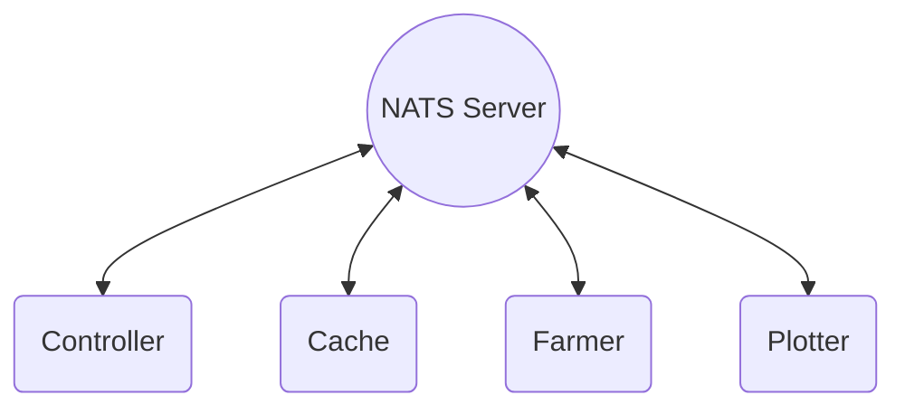
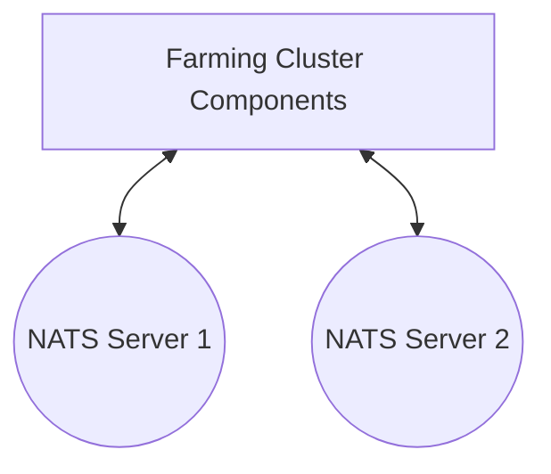
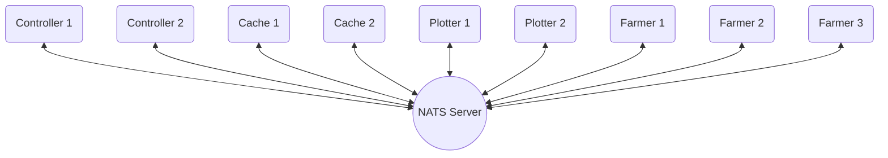

The Farming Cluster is designed for larger farmers, addressing the challenges of scaling effectively. It consists of four main components, all interconnected through a NATS Server.

This setup enables powerful remote computing capabilities. For example, if a computer is ideal for proving challenges but not for plotting, you can run the farmer component on that machine while utilizing one or more remote machines for plotting. This ensures continuous plotting and replotting across all storage locations, optimizing the use of plotters until all sectors are fully plotted and replotted.

<div style={{ textAlign: 'center' }}>


</div>

## Networking Considerations

Farming Cluster employs a modular architecture for operating a farm, where each component can function independently and can be scaled by running multiple instances of a component for added scalability and redundancy. As such, it is essential to ensure sufficient LAN bandwidth to facilitate efficient communication of this data transfer across your network between these components.

:::caution Networking Requirements

A 1 Gbit network connection is likely insufficient for this traffic, especially when using GPU plotting resources or multiple plotters. In such cases, a 2.5 Gbit connection should be considered the minimum, with an upgrade to 10 Gbit or higher for larger clusters.

:::

:::info Bandwidth Optimization Suggestion

You can reduce LAN bandwidth usage by running the NATS, Controller, Cache, and Plotter components on the same machine. This setup allows most data transfer to occur over the local loopback interface.

:::

## Key Benefits

- **Remote Compute Capability**  
  Multiple PCs can contribute their CPU and GPU resources for plotting and replotting, without the need to store farms locally.

- **Redundancy**  
  Running multiple computers for each process increases redundancy and system resilience.

- **Bandwidth Efficiency**  
  Centralized storage of the piece cache helps conserve WAN bandwidth.
  
- **Additional Space**  
  Relocating the piece sync cache to a central location frees up an additional 1% of farm capacity for farming, compared to the Standalone Farmer.


## NATS

At the core of Farming Cluster is a third-party software called [NATS](https://nats.io/), which is used for communication between the farming components.

The simplest way to install and run NATS is via Docker. 

<details open>
<summary>Set Up and Configure NATS</summary>

1. Create and save a `nats.config` configuration file with the following:

```bash title="nats.conf"
max_payload = 2MB
```
2. Start NATS with Docker:

:::tip Replace these placeholders

- `<PATH_TO_NATS_CONFIG>`: The path to your nats.config file created in step 1

:::

```bash
docker run \
    --name nats \
    --restart unless-stopped \
    --publish 4222:4222 \
    --volume <PATH_TO_NATS_CONFIG>:/nats.config:ro \
    nats -c /nats.config
```

</details>

---


## Component Configuration


Configuring Cluster Farming is similar to setting up the Standalone Farmer, but each component must be configured according to the cluster setup you want to create. Keep in mind that all components communicate with one another through the NATS server you configured earlier. Below are the essential parameters needed to establish a functional cluster.

<details open>
<summary>Controller (Manages node communication and orchestrates other components.)</summary>

The first component to start is the Controller. It connects to a single node, and you must specify the node's location on the network.

:::caution Proper Port Forwarding

For your cluster to be reachable, open and forward the default port `30533` to the Controller. If you've changed the port or are using multiple controllers, set it with `--listen-on "/ip4/0.0.0.0/tcp/<PORT>"`.

If you have an IPv6 address but no public IPv4 address, setting the listen port to with `--listen-on "/ip6/::/tcp/<PORT>"`. to accept IPv6 connections is highly recommended.

Refer to our guide on [Port Forwarding](/farming/guides/port-config).

:::

:::tip Replace these placeholders

- `<NATS_IP>`: The IP address of your NATS server
- `<BASE_PATH>`: The path where the controller's peer network details will be saved
- `<NODE_IP>`: Your node's IP address
- `<RPC_PORT>`: Your node's RPC port

:::

```bash
./subspace-farmer-ubuntu-x86_64-skylake-mainnet-2025-aug-20 \
    cluster \
        --nats-server "nats://<NATS_IP>:4222" \
    controller \
        --base-path "<BASE_PATH>" \
        --node-rpc-url "ws://<NODE_IP>:<RPC_PORT>"
```

<details>
<summary>Common Parameters</summary>

Refer to `./subspace-farmer cluster controller --help` for an explanation of each option and its default values.

```bash
--listen-on "/ip4/0.0.0.0/tcp/<PORT>"
--listen-on "/ip6/::1/tcp/<PORT>"

--cache-group
--in-connections
--out-connections
--pending-in-connections
--pending-out-connections
```
</details>

</details>

<details open>
<summary>Cache (Downloads sector data from DSN peers and serves it to the plotter.)</summary>

:::caution Cache Size

The Cache stores the blockchain's Archive History. For optimal performance, the cache must be large enough to hold this data locally. If the data isn't available in the cache, plotting may slow down as it has to be fetched from peers over the DSN. Currently, we recommend a minimum of 200GiB.

The current Archive History Size can be found in the top cards on [Subscan Block Explorer](https://autonomys.subscan.io).

:::

:::tip Replace these placeholders

- `<NATS_IP>`: The IP address of your NATS server
- `<PATH_TO_CACHE>`: The path for cache storage
- `<CACHE_SIZE>`: The size for cache storage

:::

```bash
./subspace-farmer-ubuntu-x86_64-skylake-mainnet-2025-aug-20 \
    cluster \
        --nats-server "nats://<NATS_IP>:4222" \
    cache \
        path="<PATH_TO_CACHE>,size=<CACHE_SIZE>"
```

:::note Multiple caches

Multiple caches are supported on a single Cache component:
```
path="<PATH_TO_CACHE1>,size=<CACHE_SIZE1>" \
path="<PATH_TO_CACHE2>,size=<CACHE_SIZE2>"
```

:::

<details>
<summary>Common Parameters</summary>

Refer to `./subspace-farmer cluster cache --help` for an explanation of additional parameters and their default values.

```bash
--cache-group
```
</details>

</details>

<details open>
<summary>Plotter (Generates and uploads plotted sectors, downloading pieces from cache as needed)</summary>

:::tip Replace these placeholders

- `<NATS_IP>`: The IP address of your NATS server

:::

```bash
./subspace-farmer-ubuntu-x86_64-skylake-mainnet-2025-aug-20 \
    cluster \
        --nats-server "nats://<NATS_IP>:4222" \
    plotter
```

<details>
<summary>Common Parameters</summary>

Refer to `./subspace-farmer cluster plotter --help` for an explanation of parameters and their default values.

</details>

</details>

<details open>
<summary>Farmer (Manages farms, audits, and retrieves plotted pieces. Requests sector plotting from the Plotter.)</summary>

:::tip Replace these placeholders

- `<NATS_IP>`: The IP address of your NATS server
- `<REWARD_ADDRESS>`: The reward address where your winning rewards will be sent
- `<PATH_TO_FARM>`: The path for storing your farm
- `<FARM_SIZE>`: The size for storing your farm

:::

```bash
./subspace-farmer-ubuntu-x86_64-skylake-mainnet-2025-aug-20 \
    cluster \
        --nats-server "nats://<NATS_IP>:4222" \
    farmer \
        --reward-address "<REWARD_ADDRESS>" \
        path="<PATH_TO_FARM>,size=<FARM_SIZE>"
```

:::note Multiple farms

You can add multiple farms:
```
path="<PATH_TO_FARM1>,size=<FARM_SIZE1>" \
path="<PATH_TO_FARM2>,size=<FARM_SIZE2>"
```

:::

<details>
<summary>Common Parameters</summary>

Refer to `./subspace-farmer cluster farmer --help` for an explanation of each option and its default values.

```bash
--create
```
</details>

</details>

### Grouping Components

<details open>
<summary>You can run Farming Cluster components individually or combine them to run simultaneously.</summary>

```bash
./subspace-farmer-ubuntu-x86_64-skylake-mainnet-2025-aug-20 \
    cluster \
        --nats-server "nats://<NATS_IP>:4222" \
    controller \
        --base-path "<BASE_PATH>" \
        --node-rpc-url "ws://<NODE_IP>:<RPC_PORT>"
    -- \
    cache \
        path="<PATH_TO_CACHE>,size=<CACHE_SIZE>"
    -- \
    plotter
    -- \
    farmer \
        --reward-address "<REWARD_ADDRESS>" \
        path="<PATH_TO_FARM>,size=<FARM_SIZE>"
```

</details>

---


## Advanced Topics


### NATS Cluster

<details open>
<summary>Just like every other component in the Farming Cluster, it is possible to have redundant NATS servers. Doing so requires an extra step of configuring those NATS servers in their own cluster.</summary>

Check out the [NATS.io Cluster Guide](https://docs.nats.io/running-a-nats-service/configuration/clustering) for further details.

<div style={{ textAlign: 'center' }}>



</div>

<details>
<summary>Configuration</summary>

```bash
./subspace-farmer-ubuntu-x86_64-skylake-mainnet-2025-aug-20 cluster \
    controller \
        --nats-server="nats://<NATS_IP_1>:4222" \
        --nats-server="nats://<NATS_IP_2>:4222" \
        --base-path "<BASE_PATH>" \
        --node-rpc-url "ws://<NODE_IP>:<RPC_PORT>"        
```

</details>

</details>


### Multiple Components

<details open>
<summary>This will demonstrate how to run multiple components in one Farming Cluster: (1) NATS Server, (2) Controllers, (2) Caches, (2) Plotters, and (3) Farmers.</summary>

<div style={{ textAlign: 'center' }}>



</div>

:::caution Multiple Cache Groups

Each cache group must have a unique name, and controllers can be assigned one or more. Specify an alphanumeric name for each using `--cache-group "<CACHE_GROUP>"`.

:::

<details>
<summary>Configuration</summary>

```bash title="Controller #1"
./subspace-farmer-ubuntu-x86_64-skylake-mainnet-2025-aug-20 \
    cluster \
        --nats-server "nats://<NATS_IP>:4222" \
    controller \
        --base-path "<BASE_PATH>" \
        --cache-group "<CACHE_GROUP_1>" \
        --cache-group "<CACHE_GROUP_2>" \
        --node-rpc-url "ws://<NODE_IP>:<RPC_PORT>"
```

```bash title="Controller #2"
./subspace-farmer-ubuntu-x86_64-skylake-mainnet-2025-aug-20 \
    cluster \
        --nats-server "nats://<NATS_IP>:4222" \
    controller \
        --base-path "<BASE_PATH>" \
        --cache-group "<CACHE_GROUP_2>" \
        --node-rpc-url "ws://<NODE_IP>:<RPC_PORT>"
```

```bash title="Cache #1"
./subspace-farmer-ubuntu-x86_64-skylake-mainnet-2025-aug-20 \
    cluster \
        --nats-server "nats://<NATS_IP>:4222" \
    cache \
        --cache-group "<CACHE_GROUP_1>" \
        path="<PATH_TO_CACHE>,size=<CACHE_SIZE>"
```

```bash title="Cache #2"
./subspace-farmer-ubuntu-x86_64-skylake-mainnet-2025-aug-20 \
    cluster \
        --nats-server "nats://<NATS_IP>:4222" \
    cache \
        --cache-group "<CACHE_GROUP_2>" \
        path="<PATH_TO_CACHE>,size=<CACHE_SIZE>"
```

```bash title="Plotter #1"
./subspace-farmer-ubuntu-x86_64-skylake-mainnet-2025-aug-20 \
    cluster \
        --nats-server "nats://<NATS_IP>:4222" \
    plotter
```

```bash title="Plotter #2"
./subspace-farmer-ubuntu-x86_64-skylake-mainnet-2025-aug-20 \
    cluster \
        --nats-server "nats://<NATS_IP>:4222" \
    plotter
```

```bash title="Farmer #1"
./subspace-farmer-ubuntu-x86_64-skylake-mainnet-2025-aug-20 \
    cluster \
        --nats-server "nats://<NATS_IP>:4222" \
    farmer \
        --reward-address "<REWARD_ADDRESS>" \
        path="<PATH_TO_FARM>,size=<FARM_SIZE>"
```

```bash title="Farmer #2"
./subspace-farmer-ubuntu-x86_64-skylake-mainnet-2025-aug-20 \
    cluster \
        --nats-server "nats://<NATS_IP>:4222" \
    farmer \
        --reward-address "<REWARD_ADDRESS>" \
        path="<PATH_TO_FARM>,size=<FARM_SIZE>"
```

```bash title="Farmer #3"
./subspace-farmer-ubuntu-x86_64-skylake-mainnet-2025-aug-20 \
    cluster \
        --nats-server "nats://<NATS_IP>:4222" \
    farmer \
        --reward-address "<REWARD_ADDRESS>" \
        path="<PATH_TO_FARM>,size=<FARM_SIZE>"
```
</details>

</details>
