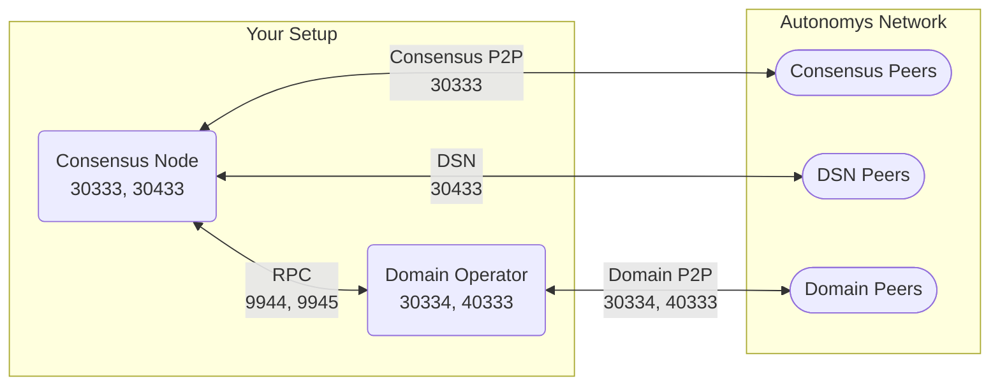

import Tabs from '@theme/Tabs';
import TabItem from '@theme/TabItem';
import Icon from '@site/src/components/Icon';
import Badge from '@site/src/components/Badge';
import { ICONS } from '@site/src/constants';

# Domain Operator <Badge variant="testnet" text="Testnet" />

Domain operators run the execution layer of Autonomys Network, processing transactions and smart contracts in parallel domains.

## Network Architecture



## Required Ports

| Port  | Protocol | Direction | Component | Purpose | Security Level |
|:------|:---------|:----------|:----------|:--------|:--------------|
| **30333** | TCP | Inbound/Outbound | Consensus Node | Consensus chain P2P | Public |
| **30334** | TCP | Inbound/Outbound | Domain Node | Domain execution P2P | Public |
| **30433** | TCP | Inbound/Outbound | Consensus Node | DSN communication | Public |
| **40333** | TCP | Inbound/Outbound | Domain Operator | Operator coordination | Public |
| **9944** | TCP | Local only | Consensus RPC | Node-operator communication | <Icon icon={ICONS.WARNING} /> Private |
| **9945** | TCP | Local only | Domain RPC | Domain state queries | <Icon icon={ICONS.WARNING} /> Private |

:::caution Critical Security
**RPC ports (9944, 9945) must NEVER be exposed to the internet.** These provide full control over your operator and could lead to stake slashing if compromised.
:::

## Complete Setup Guide

### Step 1: Network Information

<Tabs>
<TabItem value="cli" label="Command Line">

```bash
# Get public IP
echo "Public IP: $(curl -s https://api.ipify.org)"

# Get local network info
ip addr show | grep "inet " | grep -v 127.0.0.1
ip route | grep default

# Test current connectivity
ping -c 4 1.1.1.1
```

</TabItem>
<TabItem value="browser" label="Browser Method">

1. Visit [whatismyip.com](https://whatismyip.com) for public IP
2. Access router admin panel (usually `192.168.1.1`)
3. Note your computer's local IP from DHCP client list

</TabItem>
</Tabs>

### Step 2: Router Configuration

Configure these port forwarding rules in your router:

| Service Name | External Port | Internal IP | Internal Port | Protocol |
|:------------|:-------------|:------------|:-------------|:---------|
| Autonomys-Consensus | 30333 | Your IP | 30333 | TCP |
| Autonomys-Domain | 30334 | Your IP | 30334 | TCP |
| Autonomys-DSN | 30433 | Your IP | 30433 | TCP |
| Autonomys-Operator | 40333 | Your IP | 40333 | TCP |

### Step 3: Firewall Configuration

<Tabs>
<TabItem value="linux" label="Linux">

**UFW Configuration:**

```bash
# Enable firewall
sudo ufw enable

# Add operator ports
sudo ufw allow 30333/tcp comment 'Autonomys Consensus'
sudo ufw allow 30334/tcp comment 'Autonomys Domain'
sudo ufw allow 30433/tcp comment 'Autonomys DSN'
sudo ufw allow 40333/tcp comment 'Autonomys Operator'

# RPC ports - local only
sudo ufw allow from 127.0.0.1 to any port 9944 proto tcp comment 'Consensus RPC Local'
sudo ufw allow from 127.0.0.1 to any port 9945 proto tcp comment 'Domain RPC Local'

# If accessing from local network
sudo ufw allow from 192.168.1.0/24 to any port 9944 proto tcp
sudo ufw allow from 192.168.1.0/24 to any port 9945 proto tcp

# Verify configuration
sudo ufw status numbered
```

**Expected output:**
```
Status: active

     To                         Action      From
     --                         ------      ----
[1] 30333/tcp                  ALLOW IN    Anywhere
[2] 30334/tcp                  ALLOW IN    Anywhere
[3] 30433/tcp                  ALLOW IN    Anywhere
[4] 40333/tcp                  ALLOW IN    Anywhere
[5] 9944/tcp                   ALLOW IN    127.0.0.1
[6] 9945/tcp                   ALLOW IN    127.0.0.1
```

</TabItem>
<TabItem value="windows" label="Windows">

**PowerShell (Admin):**

```powershell
# Public ports
New-NetFirewallRule -DisplayName "Autonomys Consensus" `
    -Direction Inbound -Protocol TCP -LocalPort 30333 -Action Allow

New-NetFirewallRule -DisplayName "Autonomys Domain" `
    -Direction Inbound -Protocol TCP -LocalPort 30334 -Action Allow

New-NetFirewallRule -DisplayName "Autonomys DSN" `
    -Direction Inbound -Protocol TCP -LocalPort 30433 -Action Allow

New-NetFirewallRule -DisplayName "Autonomys Operator" `
    -Direction Inbound -Protocol TCP -LocalPort 40333 -Action Allow

# RPC ports - local only
New-NetFirewallRule -DisplayName "Autonomys Consensus RPC" `
    -Direction Inbound -Protocol TCP -LocalPort 9944 `
    -RemoteAddress @("127.0.0.1", "::1") -Action Allow

New-NetFirewallRule -DisplayName "Autonomys Domain RPC" `
    -Direction Inbound -Protocol TCP -LocalPort 9945 `
    -RemoteAddress @("127.0.0.1", "::1") -Action Allow

# Verify
Get-NetFirewallRule -DisplayName "Autonomys*" |
    Select DisplayName, Enabled, Action
```

</TabItem>
<TabItem value="docker" label="Docker">

```yaml
# docker-compose.yml for domain operator

services:
  node:
    image: ghcr.io/autonomys/node:latest
    container_name: autonomys-node
    ports:
      - "30333:30333"  # Consensus P2P
      - "30433:30433"  # DSN
      - "127.0.0.1:9944:9944"  # RPC local only
    volumes:
      - node-data:/data
    command: [
      "--chain", "mainnet",
      "--base-path", "/data",
      "--listen-on", "/ip4/0.0.0.0/tcp/30333",
      "--dsn-listen-on", "/ip4/0.0.0.0/tcp/30433",
      "--rpc-listen-on", "0.0.0.0:9944",
      "--rpc-cors", "all"
    ]

  domain:
    image: ghcr.io/autonomys/domain-operator:latest
    container_name: autonomys-domain
    depends_on:
      - node
    ports:
      - "30334:30334"  # Domain P2P
      - "40333:40333"  # Operator P2P
      - "127.0.0.1:9945:9945"  # Domain RPC local only
    volumes:
      - domain-data:/data
    command: [
      "--chain", "nova",
      "--base-path", "/data",
      "--operator-id", "YOUR_OPERATOR_ID",
      "--consensus-rpc", "ws://node:9944",
      "--listen-on", "/ip4/0.0.0.0/tcp/30334",
      "--operator-port", "40333",
      "--domain-rpc-port", "9945"
    ]

volumes:
  node-data:
  domain-data:
```

</TabItem>
</Tabs>

### Step 4: Start Domain Operator

<Tabs>
<TabItem value="binary" label="Binary">

```bash
# Start consensus node
./subspace-node run \
  --chain mainnet \
  --base-path /var/lib/autonomys/node \
  --listen-on /ip4/0.0.0.0/tcp/30333 \
  --dsn-listen-on /ip4/0.0.0.0/tcp/30433 \
  --rpc-listen-on 127.0.0.1:9944 \
  --rpc-cors localhost

# Start domain operator (separate terminal)
./domain-operator run \
  --chain nova \
  --base-path /var/lib/autonomys/domain \
  --operator-id YOUR_OPERATOR_ID \
  --consensus-rpc ws://127.0.0.1:9944 \
  --listen-on /ip4/0.0.0.0/tcp/30334 \
  --operator-listen-on /ip4/0.0.0.0/tcp/40333 \
  --domain-rpc-listen-on 127.0.0.1:9945
```

</TabItem>
<TabItem value="systemd" label="Systemd Service">

```bash
# Create node service
sudo tee /etc/systemd/system/autonomys-node.service << EOF
[Unit]
Description=Autonomys Consensus Node
After=network.target

[Service]
Type=simple
User=autonomys
WorkingDirectory=/home/autonomys
ExecStart=/usr/local/bin/subspace-node run \\
  --chain mainnet \\
  --base-path /var/lib/autonomys/node \\
  --listen-on /ip4/0.0.0.0/tcp/30333 \\
  --dsn-listen-on /ip4/0.0.0.0/tcp/30433 \\
  --rpc-listen-on 127.0.0.1:9944
Restart=on-failure
RestartSec=10

[Install]
WantedBy=multi-user.target
EOF

# Create domain operator service
sudo tee /etc/systemd/system/autonomys-domain.service << EOF
[Unit]
Description=Autonomys Domain Operator
After=network.target autonomys-node.service
Requires=autonomys-node.service

[Service]
Type=simple
User=autonomys
WorkingDirectory=/home/autonomys
ExecStart=/usr/local/bin/domain-operator run \\
  --chain nova \\
  --base-path /var/lib/autonomys/domain \\
  --operator-id YOUR_OPERATOR_ID \\
  --consensus-rpc ws://127.0.0.1:9944 \\
  --listen-on /ip4/0.0.0.0/tcp/30334 \\
  --operator-listen-on /ip4/0.0.0.0/tcp/40333
Restart=on-failure
RestartSec=10

[Install]
WantedBy=multi-user.target
EOF

# Enable and start services
sudo systemctl daemon-reload
sudo systemctl enable --now autonomys-node
sudo systemctl enable --now autonomys-domain

# Check status
sudo systemctl status autonomys-node autonomys-domain
```

</TabItem>
</Tabs>

### Step 5: Verify Ports

```bash
# Check all ports are listening
sudo netstat -tuln | grep -E "30333|30334|30433|40333|9944|9945"

# Expected output:
tcp  0  0  0.0.0.0:30333   LISTEN  # Consensus P2P
tcp  0  0  0.0.0.0:30334   LISTEN  # Domain P2P
tcp  0  0  0.0.0.0:30433   LISTEN  # DSN
tcp  0  0  0.0.0.0:40333   LISTEN  # Operator
tcp  0  0  127.0.0.1:9944  LISTEN  # Consensus RPC (local)
tcp  0  0  127.0.0.1:9945  LISTEN  # Domain RPC (local)

# Test external connectivity
curl -s https://api.ipify.org
# Use the IP to test from external: nc -zv YOUR_IP 30333
```

## Best Practices

<Icon icon={ICONS.CHECK_CIRCLE} /> **DO:**
- Monitor operator performance regularly
- Keep minimum stake + buffer
- Use monitoring and alerting
- Regular backups of operator keys
- Keep software updated

<Icon icon={ICONS.CLOSE_CIRCLE} /> **DON'T:**
- Expose RPC ports publicly
- Run operator on same machine as farmer
- Ignore performance degradation
- Share operator keys
- Run without proper stake


