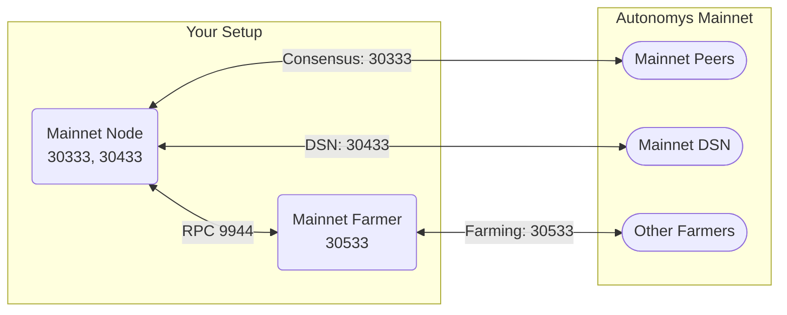
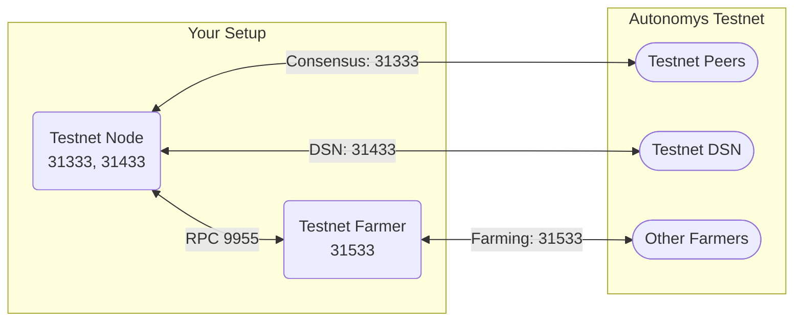

import Tabs from '@theme/Tabs';
import TabItem from '@theme/TabItem';
import Icon from '@site/src/components/Icon';
import { ICONS } from '@site/src/constants';

# Multi-Network

Running multiple Autonomys networks or configurations on the same machine requires careful port separation to avoid conflicts.

## Network Architecture

**Mainnet Setup:**



**Testnet Setup:**



## Required Ports

### Basic Node + Farmer Setup

| Network | Consensus | DSN | Farmer | RPC |
|:--------|:----------|:----|:-------|:----|
| **Mainnet** | 30333 | 30433 | 30533 | 9944 |
| **Testnet** | 31333 | 31433 | 31533 | 9955 |

### Domain Operator Setup (Additional Ports)

| Network | Domain P2P | Operator | Domain RPC |
|:--------|:-----------|:---------|:-----------|
| **Mainnet** | 30334 | 40333 | 9945 |
| **Testnet** | 31334 | 41333 | 9956 |

:::caution Separate RPC Ports Required
Each network **must** use a different RPC port to avoid conflicts. We recommend:
- **Mainnet**: 9944 (consensus), 9945 (domain)
- **Testnet**: 9955 (consensus), 9956 (domain)

Never use the same RPC port for multiple networks running simultaneously.
:::

## Complete Setup Guide

### Step 1: Router Port Forwarding

Configure these port forwarding rules for each network:

**Mainnet Port Forwarding:**

| Service Name | External Port | Internal IP | Internal Port | Protocol |
|:------------|:-------------|:------------|:-------------|:---------|
| Mainnet-Consensus | 30333 | Your IP | 30333 | TCP |
| Mainnet-DSN | 30433 | Your IP | 30433 | TCP |
| Mainnet-Farmer | 30533 | Your IP | 30533 | TCP |
| Mainnet-Domain-P2P | 30334 | Your IP | 30334 | TCP |
| Mainnet-Domain-Operator | 40333 | Your IP | 40333 | TCP |

**Testnet Port Forwarding:**

| Service Name | External Port | Internal IP | Internal Port | Protocol |
|:------------|:-------------|:------------|:-------------|:---------|
| Testnet-Consensus | 31333 | Your IP | 31333 | TCP |
| Testnet-DSN | 31433 | Your IP | 31433 | TCP |
| Testnet-Farmer | 31533 | Your IP | 31533 | TCP |
| Testnet-Domain-P2P | 31334 | Your IP | 31334 | TCP |
| Testnet-Domain-Operator | 41333 | Your IP | 41333 | TCP |

:::note Domain Operator Ports
The domain operator ports (30334/31334 and 40333/41333) are only needed if you're running domain operators on both networks. Skip these if you're only running basic node + farmer setups.
:::

### Step 2: Firewall Configuration

<Tabs>
<TabItem value="linux" label="Linux">

```bash
# Enable firewall
sudo ufw enable

# Mainnet ports
sudo ufw allow 30333/tcp comment 'Mainnet Consensus'
sudo ufw allow 30433/tcp comment 'Mainnet DSN'
sudo ufw allow 30533/tcp comment 'Mainnet Farmer'

# Mainnet domain operator ports (if needed)
sudo ufw allow 30334/tcp comment 'Mainnet Domain P2P'
sudo ufw allow 40333/tcp comment 'Mainnet Domain Operator'

# Testnet ports
sudo ufw allow 31333/tcp comment 'Testnet Consensus'
sudo ufw allow 31433/tcp comment 'Testnet DSN'
sudo ufw allow 31533/tcp comment 'Testnet Farmer'

# Testnet domain operator ports (if needed)
sudo ufw allow 31334/tcp comment 'Testnet Domain P2P'
sudo ufw allow 41333/tcp comment 'Testnet Domain Operator'

# RPC ports - local only
sudo ufw allow from 127.0.0.1 to any port 9944 proto tcp comment 'Mainnet Consensus RPC'
sudo ufw allow from 127.0.0.1 to any port 9945 proto tcp comment 'Mainnet Domain RPC'
sudo ufw allow from 127.0.0.1 to any port 9955 proto tcp comment 'Testnet Consensus RPC'
sudo ufw allow from 127.0.0.1 to any port 9956 proto tcp comment 'Testnet Domain RPC'

# Verify configuration
sudo ufw status numbered
```

</TabItem>
<TabItem value="windows" label="Windows">

```powershell
# Mainnet ports
New-NetFirewallRule -DisplayName "Mainnet Consensus" `
    -Direction Inbound -Protocol TCP -LocalPort 30333 -Action Allow

New-NetFirewallRule -DisplayName "Mainnet DSN" `
    -Direction Inbound -Protocol TCP -LocalPort 30433 -Action Allow

New-NetFirewallRule -DisplayName "Mainnet Farmer" `
    -Direction Inbound -Protocol TCP -LocalPort 30533 -Action Allow

# Mainnet domain operator ports (if needed)
New-NetFirewallRule -DisplayName "Mainnet Domain P2P" `
    -Direction Inbound -Protocol TCP -LocalPort 30334 -Action Allow

New-NetFirewallRule -DisplayName "Mainnet Domain Operator" `
    -Direction Inbound -Protocol TCP -LocalPort 40333 -Action Allow

# Testnet ports
New-NetFirewallRule -DisplayName "Testnet Consensus" `
    -Direction Inbound -Protocol TCP -LocalPort 31333 -Action Allow

New-NetFirewallRule -DisplayName "Testnet DSN" `
    -Direction Inbound -Protocol TCP -LocalPort 31433 -Action Allow

New-NetFirewallRule -DisplayName "Testnet Farmer" `
    -Direction Inbound -Protocol TCP -LocalPort 31533 -Action Allow

# Testnet domain operator ports (if needed)
New-NetFirewallRule -DisplayName "Testnet Domain P2P" `
    -Direction Inbound -Protocol TCP -LocalPort 31334 -Action Allow

New-NetFirewallRule -DisplayName "Testnet Domain Operator" `
    -Direction Inbound -Protocol TCP -LocalPort 41333 -Action Allow

# RPC ports - local only
New-NetFirewallRule -DisplayName "Mainnet Consensus RPC" `
    -Direction Inbound -Protocol TCP -LocalPort 9944 `
    -RemoteAddress @("127.0.0.1", "::1") -Action Allow

New-NetFirewallRule -DisplayName "Mainnet Domain RPC" `
    -Direction Inbound -Protocol TCP -LocalPort 9945 `
    -RemoteAddress @("127.0.0.1", "::1") -Action Allow

New-NetFirewallRule -DisplayName "Testnet Consensus RPC" `
    -Direction Inbound -Protocol TCP -LocalPort 9955 `
    -RemoteAddress @("127.0.0.1", "::1") -Action Allow

New-NetFirewallRule -DisplayName "Testnet Domain RPC" `
    -Direction Inbound -Protocol TCP -LocalPort 9956 `
    -RemoteAddress @("127.0.0.1", "::1") -Action Allow

# Verify
Get-NetFirewallRule -DisplayName "*net*" | Format-Table DisplayName, Enabled, Action
```

</TabItem>
</Tabs>

## Multi-Network Configurations

### Mainnet + Testnet Simultaneously

Running both networks on the same machine:

<Tabs>
<TabItem value="separate-instances" label="Separate Instances">

```bash
# Mainnet Configuration
./subspace-node run \
  --chain mainnet \
  --base-path /var/lib/autonomys/mainnet \
  --listen-on /ip4/0.0.0.0/tcp/30333 \
  --dsn-listen-on /ip4/0.0.0.0/tcp/30433 \
  --rpc-listen-on 127.0.0.1:9944

# Testnet Configuration (separate terminal)
./subspace-node run \
  --chain chronos \
  --base-path /var/lib/autonomys/testnet \
  --listen-on /ip4/0.0.0.0/tcp/31333 \
  --dsn-listen-on /ip4/0.0.0.0/tcp/31433 \
  --rpc-listen-on 127.0.0.1:9955

# Mainnet Farmer (separate terminal)
./subspace-farmer farm \
  --node-rpc-url ws://127.0.0.1:9944 \
  --listen-on /ip4/0.0.0.0/tcp/30533 \
  path=/farms/mainnet,size=100GiB

# Testnet Farmer (separate terminal)
./subspace-farmer farm \
  --node-rpc-url ws://127.0.0.1:9955 \
  --listen-on /ip4/0.0.0.0/tcp/31533 \
  path=/farms/testnet,size=50GiB
```

</TabItem>
<TabItem value="systemd" label="Systemd Services">

```bash
# Mainnet Node Service
sudo tee /etc/systemd/system/mainnet-node.service << EOF
[Unit]
Description=Autonomys Mainnet Node
After=network.target

[Service]
Type=simple
User=autonomys
ExecStart=/usr/local/bin/subspace-node run \\
  --chain mainnet \\
  --base-path /var/lib/autonomys/mainnet \\
  --listen-on /ip4/0.0.0.0/tcp/30333 \\
  --dsn-listen-on /ip4/0.0.0.0/tcp/30433 \\
  --rpc-listen-on 127.0.0.1:9944
Restart=on-failure

[Install]
WantedBy=multi-user.target
EOF

# Testnet Node Service
sudo tee /etc/systemd/system/testnet-node.service << EOF
[Unit]
Description=Autonomys Testnet Node
After=network.target

[Service]
Type=simple
User=autonomys
ExecStart=/usr/local/bin/subspace-node run \\
  --chain chronos \\
  --base-path /var/lib/autonomys/testnet \\
  --listen-on /ip4/0.0.0.0/tcp/31333 \\
  --dsn-listen-on /ip4/0.0.0.0/tcp/31433 \\
  --rpc-listen-on 127.0.0.1:9955
Restart=on-failure

[Install]
WantedBy=multi-user.target
EOF

# Enable and start services
sudo systemctl daemon-reload
sudo systemctl enable --now mainnet-node testnet-node
```

</TabItem>
</Tabs>


## Verification

### Check Port Usage

```bash
# Check all Autonomys ports are listening
sudo netstat -tuln | grep -E "30333|31333|30433|31433|30533|31533|30334|31334|40333|41333|9944|9945|9955|9956"

# Expected output shows both networks:
# tcp  0  0  0.0.0.0:30333  LISTEN  # Mainnet Consensus
# tcp  0  0  0.0.0.0:31333  LISTEN  # Testnet Consensus
# tcp  0  0  0.0.0.0:30433  LISTEN  # Mainnet DSN
# tcp  0  0  0.0.0.0:31433  LISTEN  # Testnet DSN
# tcp  0  0  0.0.0.0:30533  LISTEN  # Mainnet Farmer
# tcp  0  0  0.0.0.0:31533  LISTEN  # Testnet Farmer
# tcp  0  0  0.0.0.0:30334  LISTEN  # Mainnet Domain P2P (if running)
# tcp  0  0  0.0.0.0:31334  LISTEN  # Testnet Domain P2P (if running)
# tcp  0  0  0.0.0.0:40333  LISTEN  # Mainnet Domain Operator (if running)
# tcp  0  0  0.0.0.0:41333  LISTEN  # Testnet Domain Operator (if running)
# tcp  0  0  127.0.0.1:9944 LISTEN  # Mainnet Consensus RPC
# tcp  0  0  127.0.0.1:9945 LISTEN  # Mainnet Domain RPC (if running)
# tcp  0  0  127.0.0.1:9955 LISTEN  # Testnet Consensus RPC
# tcp  0  0  127.0.0.1:9956 LISTEN  # Testnet Domain RPC (if running)
```

### Test Connectivity

```bash
# Test mainnet connectivity
nc -zv localhost 30333
curl -s http://127.0.0.1:9944

# Test testnet connectivity
nc -zv localhost 31333
curl -s http://127.0.0.1:9955

# External connectivity test
nc -zv YOUR_PUBLIC_IP 30333
nc -zv YOUR_PUBLIC_IP 31333
```

## Common Issues

### Port Conflicts

**Error:** "Address already in use"

**Solution:**
```bash
# Find what's using the port
sudo lsof -i :30333

# Kill conflicting process or use different ports
./subspace-node --listen-on /ip4/0.0.0.0/tcp/32333
```

### Data Directory Separation

**Critical:** Always use separate data directories:

```bash
# Correct - separate directories
--base-path /var/lib/autonomys/mainnet
--base-path /var/lib/autonomys/testnet

# Wrong - same directory causes corruption
--base-path /var/lib/autonomys  # DON'T DO THIS
```

## Best Practices

<Icon icon={ICONS.CHECK_CIRCLE} /> **DO:**
- Use separate base paths for each network
- Document your port assignments
- Monitor resource usage closely
- Test each network independently first
- Use systemd services for production

<Icon icon={ICONS.CLOSE_CIRCLE} /> **DON'T:**
- Share data directories between networks
- Run more instances than your hardware can handle
- Expose RPC ports to the internet
- Use overlapping port ranges
- Forget to update firewall rules

