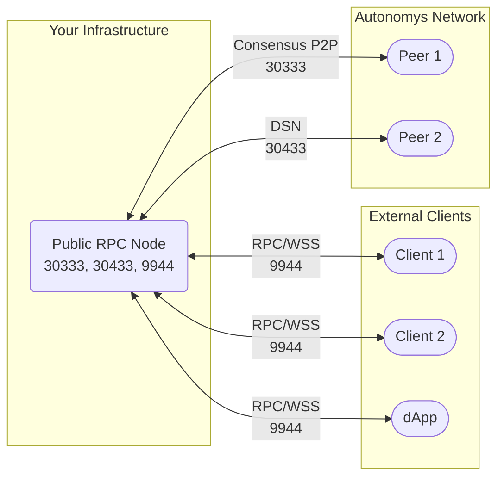

import Tabs from '@theme/Tabs';
import TabItem from '@theme/TabItem';
import Icon from '@site/src/components/Icon';
import { ICONS } from '@site/src/constants';

# Public RPC Server

:::info Advanced Infrastructure Setup
This setup is for organizations running public blockchain infrastructure services. **Most users should never set this up** - regular farmers should never expose RPC ports. This documentation exists to show the contrast with secure farming setups and guide infrastructure providers.
:::

## Network Architecture



:::caution Security Warning
**Running a public RPC server requires significant security expertise, infrastructure, and ongoing maintenance.** This is not recommended for individual farmers. Exposing RPC ports creates significant security risks.
:::

## Required Ports

| Port | Protocol | Direction | Purpose | Security Level |
|:-----|:---------|:----------|:--------|:--------------|
| 30333 | TCP | Inbound/Outbound | Consensus chain P2P | Public |
| 30433 | TCP | Inbound/Outbound | DSN communication | Public |
| 9944 | TCP/WS | Inbound | Public consensus RPC | Exposed |
| 9945 | TCP/WS | Inbound | Public domain RPC (optional) | Exposed |

## Router Port Forwarding

Configure these port forwarding rules for public RPC infrastructure:

| Service | External Port | Internal IP | Internal Port | Protocol |
|:--------|:-------------|:------------|:-------------|:---------|
| Autonomys-Consensus | 30333 | RPC Server IP | 30333 | TCP |
| Autonomys-DSN | 30433 | RPC Server IP | 30433 | TCP |
| Autonomys-RPC | 9944 | RPC Server IP | 9944 | TCP |

## Firewall Configuration

<Tabs>
<TabItem value="linux" label="Linux (iptables)">

```bash
# Base node ports
iptables -A INPUT -p tcp --dport 30333 -j ACCEPT
iptables -A INPUT -p tcp --dport 30433 -j ACCEPT

# Public RPC access (use with extreme caution)
iptables -A INPUT -p tcp --dport 9944 -j ACCEPT

# Optional domain RPC (if needed)
# iptables -A INPUT -p tcp --dport 9945 -j ACCEPT

# Monitoring (Prometheus) - restrict to trusted networks
iptables -A INPUT -p tcp -s 10.0.1.0/24 --dport 9615 -j ACCEPT

# Save rules
iptables-save > /etc/iptables/rules.v4
```

</TabItem>
<TabItem value="ufw" label="UFW">

```bash
# Node P2P ports
sudo ufw allow 30333/tcp comment 'Autonomys Consensus'
sudo ufw allow 30433/tcp comment 'Autonomys DSN'

# Public RPC access (use with extreme caution)
sudo ufw allow 9944/tcp comment 'Autonomys Public RPC'

# Internal network access for monitoring
sudo ufw allow from 10.0.1.0/24 to any port 9944 proto tcp comment 'Internal RPC'
sudo ufw allow from 10.0.1.0/24 to any port 9615 proto tcp comment 'Prometheus'

# Deny RPC from external
sudo ufw deny 9944/tcp comment 'Block external RPC'
sudo ufw deny 9945/tcp comment 'Block external domain RPC'

sudo ufw enable
sudo ufw status verbose
```

</TabItem>
</Tabs>


