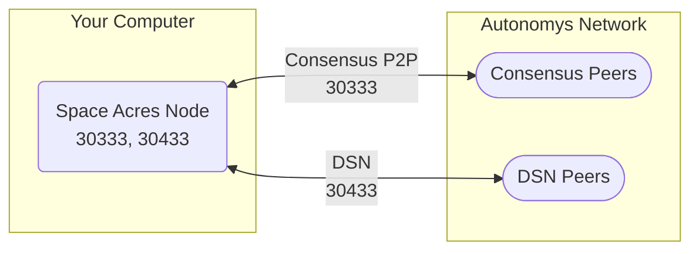

import Tabs from '@theme/Tabs';
import TabItem from '@theme/TabItem';
import Icon from '@site/src/components/Icon';
import { ICONS } from '@site/src/constants';

# Space Acres

Space Acres is the simplest way to farm on Autonomys Network, requiring only two ports to be forwarded for optimal performance.

## Network Architecture



## Required Ports

| Port  | Protocol | Direction | Purpose | Impact if Blocked |
|:------|:---------|:----------|:--------|:------------------|
| **30333** | TCP | Inbound/Outbound | Consensus chain P2P | Limited peer connections, slower sync |
| **30433** | TCP | Inbound/Outbound | DSN communication | Reduced piece retrieval, lower rewards |

## Step-by-Step Configuration

### Step 1: Find Your Network Information

<Tabs>
<TabItem value="windows" label="Windows">

```powershell
# Find your router's IP address (Default Gateway)
ipconfig | findstr "Default Gateway"

# Find your computer's IP address
ipconfig | findstr "IPv4 Address"

# Note these addresses - you'll need them for router configuration
```

</TabItem>
<TabItem value="linux" label="Linux/macOS">

```bash
# Find your router's IP address (Default Gateway)
ip route | grep default
# Alternative:
netstat -rn | grep default

# Find your computer's IP address
hostname -I | awk '{print $1}'
# Alternative:
ip addr show | grep "inet " | grep -v 127.0.0.1
```

</TabItem>
<TabItem value="browser" label="Browser Method">

**To find your public IP address:**
1. Visit [whatismyip.com](https://whatismyip.com) in your browser
2. Note your public IP address shown

**To find your local IP address:**
- Windows: Open Command Prompt and type `ipconfig`
- Mac: Open System Preferences → Network
- Linux: Open Terminal and type `hostname -I`

</TabItem>
</Tabs>

### Step 2: Configure Your Router

1. **Access Router Admin Panel**
   - Open your web browser
   - Enter your router's IP address (typically `192.168.1.1` or `192.168.0.1`)
   - Login with admin credentials (check router label if unknown)

2. **Navigate to Port Forwarding**
   - Look for: "Port Forwarding", "Virtual Servers", "NAT", or "Applications"
   - This is usually under "Advanced Settings" or "Security"

3. **Create Port Forwarding Rules**

   **Rule 1: Consensus Port**
   - Service Name: `Autonomys-Consensus`
   - Protocol: `TCP`
   - External Port: `30333`
   - Internal IP: Your computer's IP (from Step 1)
   - Internal Port: `30333`
   - Enable: <Icon icon={ICONS.CHECK_CIRCLE} />

   **Rule 2: DSN Port**
   - Service Name: `Autonomys-DSN`
   - Protocol: `TCP`
   - External Port: `30433`
   - Internal IP: Your computer's IP (from Step 1)
   - Internal Port: `30433`
   - Enable: <Icon icon={ICONS.CHECK_CIRCLE} />

4. **Save and Apply Changes**
   - Click Save/Apply
   - Router may restart

### Step 3: Configure Your Firewall

<Tabs>
<TabItem value="windows" label="Windows">

**Using Windows Defender Firewall:**

```powershell
# Run PowerShell as Administrator

# Create inbound rules
New-NetFirewallRule -DisplayName "Autonomys Consensus" `
    -Direction Inbound -Protocol TCP -LocalPort 30333 -Action Allow

New-NetFirewallRule -DisplayName "Autonomys DSN" `
    -Direction Inbound -Protocol TCP -LocalPort 30433 -Action Allow

# Verify rules were created
Get-NetFirewallRule -DisplayName "Autonomys*" | Format-Table DisplayName, Enabled, Direction
```

**Alternative GUI Method:**
1. Open Windows Defender Firewall with Advanced Security
2. Click "Inbound Rules" → "New Rule"
3. Select "Port" → Next
4. Select "TCP" and enter "30333, 30433" → Next
5. Select "Allow the connection" → Next
6. Check all profiles → Next
7. Name it "Autonomys Network Ports" → Finish

</TabItem>
<TabItem value="linux" label="Linux">

**Using UFW (Ubuntu/Debian):**

```bash
# Enable firewall if not already active
sudo ufw enable

# Allow Space Acres ports
sudo ufw allow 30333/tcp comment 'Autonomys Consensus'
sudo ufw allow 30433/tcp comment 'Autonomys DSN'

# Check status
sudo ufw status verbose
```

**Using iptables:**

```bash
# Allow ports
sudo iptables -A INPUT -p tcp --dport 30333 -j ACCEPT
sudo iptables -A INPUT -p tcp --dport 30433 -j ACCEPT

# Save rules (varies by distribution)
# Ubuntu/Debian:
sudo iptables-save > /etc/iptables/rules.v4
# RHEL/CentOS:
sudo service iptables save
```

</TabItem>
<TabItem value="macos" label="macOS">

macOS typically allows outgoing connections by default. For incoming:

**Using System Preferences:**
1. System Preferences → Security & Privacy → Firewall
2. Click "Firewall Options"
3. Add Space Acres to allowed applications
4. Ensure "Block all incoming connections" is unchecked

**Using Terminal (pfctl):**

```bash
# Add rules to pf configuration
echo "pass in proto tcp from any to any port 30333" | sudo tee -a /etc/pf.conf
echo "pass in proto tcp from any to any port 30433" | sudo tee -a /etc/pf.conf

# Load and enable firewall rules
sudo pfctl -f /etc/pf.conf
sudo pfctl -e
```

</TabItem>
</Tabs>

### Step 4: Verify Configuration

After configuring ports, verify they're accessible:

<Tabs>
<TabItem value="online" label="Online Port Checker">

1. Start Space Acres and ensure it's running
2. Visit [canyouseeme.org](https://canyouseeme.org)
3. Enter port `30333` and click "Check Port"
4. Should show "Success: I can see your service"
5. Repeat for port `30433`

:::note
Ports will show as "closed" if Space Acres isn't running when you test.
:::

</TabItem>
<TabItem value="command" label="Command Line">

```bash
# Get your public IP
curl -s https://api.ipify.org
# Or visit whatismyip.com

# Test from another computer (replace YOUR_IP)
nc -zv YOUR_IP 30333
nc -zv YOUR_IP 30433

# Expected output: "Connection to YOUR_IP 30333 port [tcp/*] succeeded!"
```

</TabItem>
<TabItem value="space-acres" label="In Space Acres">

Check the Space Acres interface:
1. Look at the "Network" or "Peers" section
2. You should see 40+ peers connected
3. Sync should progress smoothly
4. DSN should show active connections

**Signs of Good Configuration:**
- Peer count > 40
- Steady sync progress
- No "Network isolated" warnings

</TabItem>
</Tabs>

## Troubleshooting

### Few or No Peers

**Symptoms:**
- Peer count stays below 40
- Slow or stuck synchronization

**Solutions:**
1. Verify port forwarding is active in router
2. Check Windows/OS firewall isn't blocking
3. Restart Space Acres
4. Try using a different port if ISP blocks default ones

### Port Already in Use

**Error:** "Address already in use"

**Solution:**
```bash
# Find what's using the port (Windows)
netstat -ano | findstr :30333

# Find what's using the port (Linux/Mac)
sudo lsof -i :30333

# Either stop the conflicting service or use different ports in Space Acres settings
```

### Behind CGNAT/Double NAT

**Identifying CGNAT:**
Your router's WAN IP starts with:
- 10.x.x.x
- 100.64.x.x to 100.127.x.x
- 172.16.x.x to 172.31.x.x

**Solutions:**
1. Contact ISP for public IP address
2. Use IPv6 if available
3. Consider VPN with port forwarding support

## Advanced Options

### Custom Port Configuration

If default ports are blocked or in use:

1. Open Space Acres settings
2. Navigate to Advanced → Network
3. Change ports (example):
   - Consensus: 31333
   - DSN: 31433
4. Update router port forwarding to match
5. Update firewall rules to match

### Static IP Assignment

For stable port forwarding:

1. Router Admin → DHCP Settings
2. Find DHCP Reservations/Static IP
3. Add reservation:
   - MAC Address: Your computer's MAC
   - IP Address: Assign fixed IP
4. Update port forwarding to use this IP

## Best Practices

<Icon icon={ICONS.CHECK_CIRCLE} /> **DO:**
- Use static/reserved IP for your farming computer
- Keep Space Acres updated
- Monitor peer connections regularly
- Document your port configuration

<Icon icon={ICONS.CLOSE_CIRCLE} /> **DON'T:**
- Expose RPC ports (Space Acres handles this internally)
- Use DMZ unless absolutely necessary
- Disable your firewall completely
- Share your IP address publicly
