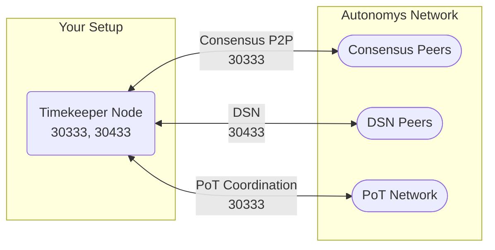

import Tabs from '@theme/Tabs';
import TabItem from '@theme/TabItem';
import Icon from '@site/src/components/Icon';
import { ICONS } from '@site/src/constants';

# Timekeeper

Timekeepers run the Proof-of-Time chain and maintain the randomness beacon that secures the consensus chain. They require high-performance hardware and low-latency connections.

## Network Architecture



## Required Ports

| Port  | Protocol | Direction | Component | Purpose | Impact if Blocked |
|:------|:---------|:----------|:----------|:--------|:------------------|
| **30333** | TCP | Inbound/Outbound | Node (Consensus + PoT) | Consensus chain P2P and Proof-of-Time coordination | Disconnected from PoT chain, cannot contribute to randomness beacon |
| **30433** | TCP | Inbound/Outbound | Node (DSN) | DSN communication for archival data | Reduced network participation |
| **9944** | TCP | Local only | Node RPC | Local management and monitoring | <Icon icon={ICONS.WARNING} /> Never expose to internet |

## Complete Setup Guide

### Step 1: Router Configuration

Configure these port forwarding rules:

| Service Name | External Port | Internal IP | Internal Port | Protocol |
|:------------|:-------------|:------------|:-------------|:---------|
| Autonomys-Consensus-PoT | 30333 | Your IP | 30333 | TCP |
| Autonomys-DSN | 30433 | Your IP | 30433 | TCP |

### Step 2: Firewall Configuration

<Tabs>
<TabItem value="linux" label="Linux">

**UFW Configuration:**

```bash
# Enable firewall
sudo ufw enable

# Add timekeeper ports
sudo ufw allow 30333/tcp comment 'Autonomys Consensus PoT'
sudo ufw allow 30433/tcp comment 'Autonomys DSN'

# RPC port - local only
sudo ufw allow from 127.0.0.1 to any port 9944 proto tcp comment 'Node RPC Local'

# Verify configuration
sudo ufw status numbered
```

</TabItem>
<TabItem value="windows" label="Windows">

**PowerShell (Admin):**

```powershell
# Public ports
New-NetFirewallRule -DisplayName "Autonomys Timekeeper Consensus" `
    -Direction Inbound -Protocol TCP -LocalPort 30333 -Action Allow

New-NetFirewallRule -DisplayName "Autonomys Timekeeper DSN" `
    -Direction Inbound -Protocol TCP -LocalPort 30433 -Action Allow

# RPC port - local only
New-NetFirewallRule -DisplayName "Autonomys Timekeeper RPC" `
    -Direction Inbound -Protocol TCP -LocalPort 9944 `
    -RemoteAddress @("127.0.0.1", "::1") -Action Allow

# Verify
Get-NetFirewallRule -DisplayName "Autonomys*" |
    Select DisplayName, Enabled, Action
```

</TabItem>
</Tabs>


