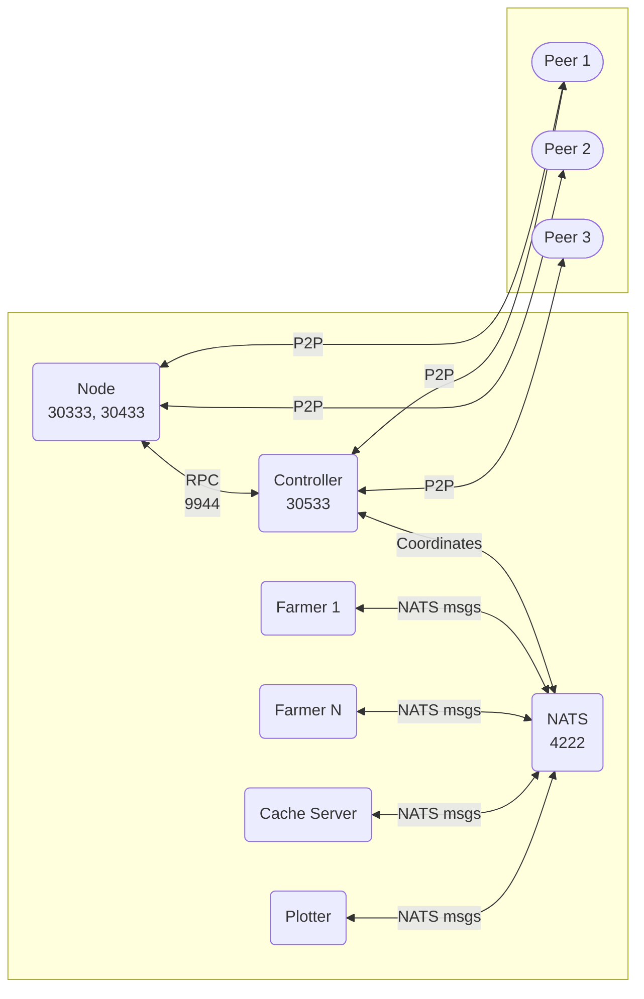

import Tabs from '@theme/Tabs';
import TabItem from '@theme/TabItem';
import Icon from '@site/src/components/Icon';
import { ICONS } from '@site/src/constants';

# Farming Cluster

A farming cluster allows you to scale your operation across multiple machines and storage devices for maximum efficiency and redundancy.

## Cluster Architecture



**Key Concept:** The controller connects to the blockchain node via RPC and coordinates all cluster components (cache, plotters, farmers) through NATS messaging. Only the controller talks to the blockchain; farmers communicate through the controller.

## Port Requirements

| Port | Protocol | Component | Purpose | Expose to Internet |
|:-----|:---------|:----------|:--------|:------------------|
| **30333** | TCP | Node | Consensus P2P | <Icon icon={ICONS.CHECK_CIRCLE} /> Yes |
| **30433** | TCP | Node | DSN communication | <Icon icon={ICONS.CHECK_CIRCLE} /> Yes |
| **30533** | TCP | Controller | Cluster Controller P2P | <Icon icon={ICONS.CHECK_CIRCLE} /> Yes |
| **9944** | TCP | Node → Controller | RPC communication | <Icon icon={ICONS.CLOSE_CIRCLE} /> Internal only |
| **4222** | TCP | NATS ↔ All cluster components* | Internal coordination | <Icon icon={ICONS.CLOSE_CIRCLE} /> Internal only |

**\*NATS connects to:** Controller, Cache, Plotter, Farmer (but NOT the Node)

:::tip Cluster Communication
- **Node**: Handles blockchain P2P (30333, 30433) and provides RPC to controller (9944)
- **Controller**: Talks to node via RPC (9944), connects to blockchain peers (30533), and coordinates via NATS (4222)
- **All other components**: Only communicate through NATS (4222) - no direct blockchain access
:::

## Network Setup Guide

### Step 1: Controller Machine Configuration

<Tabs>
<TabItem value="router" label="Router Setup">

Configure these port forwarding rules for the controller machine:

| Service | External Port | Internal IP | Internal Port | Protocol |
|:--------|:-------------|:------------|:-------------|:---------|
| Consensus | 30333 | Controller IP | 30333 | TCP |
| DSN | 30433 | Controller IP | 30433 | TCP |
| Cluster Controller | 30533 | Controller IP | 30533 | TCP |

**Do NOT forward:**
- Port 4222 (NATS) - internal cluster communication only
- Port 9944 (RPC) - internal cluster communication only

</TabItem>
<TabItem value="firewall" label="Firewall Setup">

```bash
# Linux (UFW)
# Public ports
sudo ufw allow 30333/tcp comment 'Cluster Consensus'
sudo ufw allow 30433/tcp comment 'Cluster DSN'
sudo ufw allow 30533/tcp comment 'Cluster Controller'

# Internal cluster network (adjust subnet)
sudo ufw allow from 192.168.1.0/24 to any port 4222 proto tcp comment 'NATS Internal'
sudo ufw allow from 192.168.1.0/24 to any port 9944 proto tcp comment 'RPC Internal'

# Windows PowerShell
New-NetFirewallRule -DisplayName "Cluster Consensus" `
    -Direction Inbound -Protocol TCP -LocalPort 30333 -Action Allow
New-NetFirewallRule -DisplayName "Cluster DSN" `
    -Direction Inbound -Protocol TCP -LocalPort 30433 -Action Allow
New-NetFirewallRule -DisplayName "Cluster Controller" `
    -Direction Inbound -Protocol TCP -LocalPort 30533 -Action Allow

# NATS internal
New-NetFirewallRule -DisplayName "NATS Internal" `
    -Direction Inbound -Protocol TCP -LocalPort 4222 `
    -RemoteAddress LocalSubnet -Action Allow
```

</TabItem>
</Tabs>

### Step 2: Farmer Machines Configuration

Farmer machines only need internal network access to communicate with the controller's NATS server:

<Tabs>
<TabItem value="router-farmers" label="Router Configuration">

**No port forwarding needed** for farmer machines. They only communicate internally with the controller.

</TabItem>
<TabItem value="firewall-farmers" label="Firewall Configuration">

```bash
# On each farmer machine
# Allow outbound NATS connection to controller
sudo ufw allow out to CONTROLLER_IP port 4222 proto tcp comment 'NATS to Controller'

# Windows
New-NetFirewallRule -DisplayName "NATS to Controller" `
    -Direction Outbound -Protocol TCP `
    -RemoteAddress CONTROLLER_IP -RemotePort 4222 -Action Allow
```

</TabItem>
</Tabs>

### Step 3: Internal Network Configuration

Set up the internal cluster network:

```bash
# 1. Assign static IPs or DHCP reservations
# Controller:     192.168.1.10
# Cache Server 1: 192.168.1.11
# Cache Server 2: 192.168.1.12
# Farmer 1:       192.168.1.21
# Farmer 2:       192.168.1.22
# etc.

# 2. Ensure all machines can communicate
# Test from each machine:
ping 192.168.1.10  # Controller
telnet 192.168.1.10 4222  # NATS server
telnet 192.168.1.10 9944  # Node RPC
```


