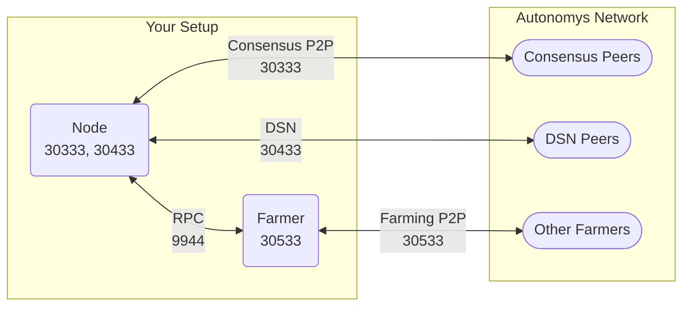

import Tabs from '@theme/Tabs';
import TabItem from '@theme/TabItem';
import Icon from '@site/src/components/Icon';
import { ICONS } from '@site/src/constants';

# CLI

The CLI provides more control over your setup but requires configuring additional ports for the separate node and farmer components.

## Network Architecture



## Required Ports

| Port  | Protocol | Direction | Component | Purpose | Impact if Blocked |
|:------|:---------|:----------|:----------|:--------|:------------------|
| **30333** | TCP | Inbound/Outbound | Node | Consensus P2P | Poor block propagation, missed PoT slots |
| **30433** | TCP | Inbound/Outbound | Node | DSN communication | Slow piece retrieval, reduced cache efficiency |
| **30533** | TCP | Inbound/Outbound | Farmer | Farmer P2P network | Missed challenges, reduced rewards |
| **9944** | TCP | Local only | Node | RPC for farmer-node communication | <Icon icon={ICONS.WARNING} /> Never expose to internet |

:::caution Security Warning
**RPC port 9944 should NEVER be exposed to the internet.** This port contains sensitive APIs that could compromise your node. It should only be accessible locally or within your secure network.
:::

## Complete Setup Guide

### Step 1: Gather Network Information

<Tabs>
<TabItem value="cli" label="Command Line Method">

```bash
# Get your public IP address
curl -s https://api.ipify.org
echo "Your public IP: $(curl -s https://api.ipify.org)"

# Get your local IP and gateway
# Linux/macOS:
ip route | grep default  # Gateway
hostname -I | awk '{print $1}'  # Local IP

# Windows PowerShell:
ipconfig | findstr "Default Gateway"  # Gateway
ipconfig | findstr "IPv4 Address"  # Local IP
```

</TabItem>
<TabItem value="browser" label="Browser Method">

**Public IP Address:**
- Visit [whatismyip.com](https://whatismyip.com)
- Note the IPv4 address shown

**Local Network Info:**
1. Windows: Run `cmd` → type `ipconfig`
2. macOS: System Preferences → Network → Advanced
3. Linux: Terminal → `ip addr show`

**Router IP (Gateway):**
- Usually `192.168.1.1` or `192.168.0.1`
- Check router label or network settings

</TabItem>
</Tabs>

### Step 2: Router Port Forwarding

Access your router's admin panel and create these port forwarding rules:

| Rule Name | External Port | Internal IP | Internal Port | Protocol |
|:----------|:-------------|:------------|:-------------|:---------|
| Autonomys-Node-Consensus | 30333 | Your PC IP | 30333 | TCP |
| Autonomys-Node-DSN | 30433 | Your PC IP | 30433 | TCP |
| Autonomys-Farmer | 30533 | Your PC IP | 30533 | TCP |

:::tip Router Access
Common router admin URLs:
- `http://192.168.1.1`
- `http://192.168.0.1`

Default credentials are often on the router label.
:::

### Step 3: Firewall Configuration

<Tabs>
<TabItem value="windows" label="Windows">

**PowerShell (Run as Administrator):**

```powershell
# Create firewall rules for CLI farming
New-NetFirewallRule -DisplayName "Autonomys Node Consensus" `
    -Direction Inbound -Protocol TCP -LocalPort 30333 -Action Allow

New-NetFirewallRule -DisplayName "Autonomys Node DSN" `
    -Direction Inbound -Protocol TCP -LocalPort 30433 -Action Allow

New-NetFirewallRule -DisplayName "Autonomys Farmer" `
    -Direction Inbound -Protocol TCP -LocalPort 30533 -Action Allow

# RPC for local network only (adjust subnet as needed)
New-NetFirewallRule -DisplayName "Autonomys RPC Local" `
    -Direction Inbound -Protocol TCP -LocalPort 9944 `
    -RemoteAddress LocalSubnet -Action Allow

# Verify rules
Get-NetFirewallRule -DisplayName "Autonomys*" |
    Format-Table DisplayName, Enabled, Direction, Action
```

**Expected output:**
```
DisplayName              Enabled Direction Action
-----------              ------- --------- ------
Autonomys Node Consensus True    Inbound   Allow
Autonomys Node DSN       True    Inbound   Allow
Autonomys Farmer         True    Inbound   Allow
Autonomys RPC Local      True    Inbound   Allow
```

</TabItem>
<TabItem value="linux" label="Linux">

**UFW (Ubuntu/Debian):**

```bash
# Enable firewall
sudo ufw enable

# Allow required ports
sudo ufw allow 30333/tcp comment 'Autonomys Node Consensus'
sudo ufw allow 30433/tcp comment 'Autonomys Node DSN'
sudo ufw allow 30533/tcp comment 'Autonomys Farmer'

# RPC for local network only (adjust subnet)
sudo ufw allow from 192.168.1.0/24 to any port 9944 proto tcp comment 'Node RPC Local'

# Verify configuration
sudo ufw status verbose
```

**Expected output:**
```
Status: active
To                         Action      From
--                         ------      ----
30333/tcp                  ALLOW       Anywhere                   # Autonomys Node Consensus
30433/tcp                  ALLOW       Anywhere                   # Autonomys Node DSN
30533/tcp                  ALLOW       Anywhere                   # Autonomys Farmer
9944/tcp                   ALLOW       192.168.1.0/24             # Node RPC Local
```

**Firewalld (RHEL/Fedora):**

```bash
# Add ports
sudo firewall-cmd --permanent --add-port=30333/tcp
sudo firewall-cmd --permanent --add-port=30433/tcp
sudo firewall-cmd --permanent --add-port=30533/tcp

# RPC for local only
sudo firewall-cmd --permanent --add-rich-rule='
  rule family="ipv4"
  source address="192.168.1.0/24"
  port protocol="tcp" port="9944" accept'

# Reload configuration
sudo firewall-cmd --reload

# Verify
sudo firewall-cmd --list-all
```

</TabItem>
<TabItem value="macos" label="macOS">

**Using pfctl:**

```bash
# Create pf rules file
sudo tee /etc/pf.anchors/autonomys << EOF
# Autonomys Network Ports
pass in proto tcp from any to any port 30333
pass in proto tcp from any to any port 30433
pass in proto tcp from any to any port 30533
# RPC local only
pass in proto tcp from 192.168.1.0/24 to any port 9944
EOF

# Load anchor in main config
echo "anchor \"autonomys\"" | sudo tee -a /etc/pf.conf
echo "load anchor \"autonomys\" from \"/etc/pf.anchors/autonomys\"" | sudo tee -a /etc/pf.conf

# Enable and load rules
sudo pfctl -e -f /etc/pf.conf
```

**GUI Method:**
1. System Preferences → Security & Privacy → Firewall
2. Firewall Options → Add subspace-node and subspace-farmer
3. Ensure "Block all incoming" is unchecked

</TabItem>
</Tabs>

### Step 4: Start Node and Farmer

Start your node with explicit network configuration:

<Tabs>
<TabItem value="basic" label="Basic Start">

```bash
# Start node
./subspace-node run \
  --chain mainnet \
  --listen-on /ip4/0.0.0.0/tcp/30333 \
  --dsn-listen-on /ip4/0.0.0.0/tcp/30433 \
  --rpc-listen-on 127.0.0.1:9944

# Start farmer (in separate terminal)
./subspace-farmer farm \
  --node-rpc-url ws://127.0.0.1:9944 \
  --listen-on /ip4/0.0.0.0/tcp/30533 \
  path=/path/to/farm,size=100GiB
```

</TabItem>
<TabItem value="systemd" label="Systemd Service">

```bash
# Node service configuration
sudo tee /etc/systemd/system/subspace-node.service << EOF
[Unit]
Description=Subspace Node
After=network.target

[Service]
Type=simple
User=subspace
ExecStart=/usr/local/bin/subspace-node run \\
  --chain mainnet \\
  --base-path /var/lib/subspace-node \\
  --listen-on /ip4/0.0.0.0/tcp/30333 \\
  --dsn-listen-on /ip4/0.0.0.0/tcp/30433 \\
  --rpc-listen-on 127.0.0.1:9944
Restart=on-failure

[Install]
WantedBy=multi-user.target
EOF

# Start services
sudo systemctl daemon-reload
sudo systemctl enable --now subspace-node
sudo systemctl enable --now subspace-farmer
```

</TabItem>
<TabItem value="docker" label="Docker">

```yaml
# docker-compose.yml

services:
  node:
    image: ghcr.io/autonomys/node:latest
    ports:
      - "30333:30333"  # Consensus P2P
      - "30433:30433"  # DSN
      - "127.0.0.1:9944:9944"  # RPC local only
    command: [
      "run",
      "--chain", "mainnet",
      "--listen-on", "/ip4/0.0.0.0/tcp/30333",
      "--dsn-listen-on", "/ip4/0.0.0.0/tcp/30433",
      "--rpc-listen-on", "0.0.0.0:9944"
    ]

  farmer:
    image: ghcr.io/autonomys/farmer:latest
    depends_on:
      - node
    ports:
      - "30533:30533"  # Farmer P2P
    command: [
      "farm",
      "--node-rpc-url", "ws://node:9944",
      "--listen-on", "/ip4/0.0.0.0/tcp/30533",
      "path=/farms/farm1,size=100GiB"
    ]
```

</TabItem>
</Tabs>

### Step 5: Verify Configuration

<Tabs>
<TabItem value="logs" label="Check Logs">

**Node logs should show:**
```
Subspace Node
Chain: Mainnet
Node name: YOUR_NODE_NAME
Listening on: /ip4/0.0.0.0/tcp/30333
DSN listening on: /ip4/0.0.0.0/tcp/30433
Discovered new peer: 12D3KooW...
Peers: 25
```

**Farmer logs should show:**
```
Subspace Farmer
Connected to node: ws://127.0.0.1:9944
Listening on: /ip4/0.0.0.0/tcp/30533
Farm size: 100.0 GB
Plotted sectors: 150/200
Farming peers: 18
```

</TabItem>
<TabItem value="ports" label="Test Ports">

```bash
# Check listening ports
netstat -tuln | grep -E "30333|30433|30533|9944"

# Expected output:
tcp  0  0  0.0.0.0:30333  0.0.0.0:*  LISTEN
tcp  0  0  0.0.0.0:30433  0.0.0.0:*  LISTEN
tcp  0  0  0.0.0.0:30533  0.0.0.0:*  LISTEN
tcp  0  0  127.0.0.1:9944 0.0.0.0:*  LISTEN  # Local only!

# Test external connectivity (from another machine)
nc -zv YOUR_PUBLIC_IP 30333
# Expected: Connection succeeded

# Test with online tool
# Visit https://canyouseeme.org and test each port
```

</TabItem>
<TabItem value="metrics" label="Check Metrics">

```bash
# Query node metrics
curl -s http://127.0.0.1:9615/metrics | grep peers
# Expected: subspace_sub_libp2p_peers_count 20+

# Check farmer logs for status
grep -i "farm\|allocated space" /path/to/farmer.log | tail -3
# Shows farm allocation and farming status
```

</TabItem>
</Tabs>

## Common Issues and Solutions

### Issue: Low Peer Count

**Symptoms:**
- Node shows < 40 peers
- Slow synchronization

**Diagnostic Steps:**
```bash
# 1. Check if ports are actually open
sudo netstat -tuln | grep -E "30333|30433|30533"

# 2. Test from external source
curl -s https://api.ipify.org  # Get your IP
# Have a friend run: nc -zv YOUR_IP 30333

# 3. Check firewall logs
# Linux: sudo journalctl -u ufw -n 50
# Windows: Get-WinEvent -FilterHashtable @{LogName="Microsoft-Windows-Windows Firewall With Advanced Security/Firewall"; ID=2004}
```

**Solutions:**
1. Verify router port forwarding saved correctly
2. Check for double NAT (router behind router)
3. Ensure firewall rules are active
4. Try alternate ports if ISP blocks defaults

### Issue: RPC Connection Failed

**Error:** "Cannot connect to node RPC"

**Solutions:**
```bash
# 1. Verify node is running and RPC is enabled
ps aux | grep subspace-node

# 2. Check RPC is listening
netstat -tuln | grep 9944

# 3. Test RPC locally
curl -H "Content-Type: application/json" \
  -d '{"id":1, "jsonrpc":"2.0", "method": "system_health"}' \
  http://127.0.0.1:9944

# 4. If using Docker, ensure correct network
docker network ls
docker inspect subspace-node | grep NetworkMode
```

### Issue: CGNAT / No Public IP

**Identifying CGNAT:**
```bash
# Check if behind CGNAT
curl -s https://api.ipify.org  # Public IP
# Compare with router WAN IP
# If different = likely CGNAT
```

**Solutions:**
1. **Request public IP from ISP** (may cost extra)
2. **Use IPv6** if available:
   ```bash
   --listen-on /ip6/::/tcp/30333
   ```
3. **VPN with port forwarding** (impacts performance)
4. **Rent a VPS** as public entry point

## Advanced Configurations

### Multiple Farmers, Single Node

```bash
# Node (Machine 1)
./subspace-node run \
  --rpc-listen-on 0.0.0.0:9944 \
  --rpc-cors all

# Farmer 1 (Machine 2)
./subspace-farmer farm \
  --node-rpc-url ws://machine1:9944 \
  --listen-on /ip4/0.0.0.0/tcp/30533

# Farmer 2 (Machine 3)
./subspace-farmer farm \
  --node-rpc-url ws://machine1:9944 \
  --listen-on /ip4/0.0.0.0/tcp/30534  # Different port!
```

### Custom Port Configuration

If default ports are blocked:

```bash
# Node with custom ports
./subspace-node run \
  --listen-on /ip4/0.0.0.0/tcp/31333 \
  --dsn-listen-on /ip4/0.0.0.0/tcp/31433 \
  --rpc-port 9955

# Farmer with custom port
./subspace-farmer farm \
  --node-rpc-url ws://127.0.0.1:9955 \
  --listen-on /ip4/0.0.0.0/tcp/31533
```

Remember to update router and firewall rules to match!

## Security Best Practices

<Icon icon={ICONS.CHECK_CIRCLE} /> **DO:**
- Keep RPC port (9944) local only
- Use strong firewall rules
- Monitor logs for suspicious activity
- Regular software updates
- Use fail2ban for SSH if exposed

<Icon icon={ICONS.CLOSE_CIRCLE} /> **DON'T:**
- Expose RPC to internet
- Use `--rpc-methods unsafe` with public RPC
- Disable firewall completely
- Use DMZ for farming setup
- Share node/farmer private keys

